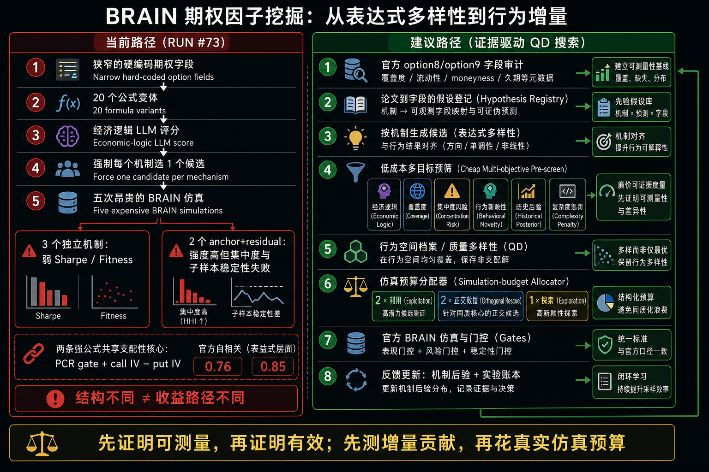
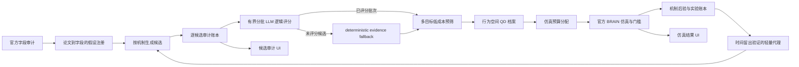

# BRAIN 期权因子挖掘：RUN #73 复盘与证据驱动搜索重构

日期：2026-08-13

实现状态：P0、P1 与适合个人项目算力边界的 P2 已落地。options 运行会读取官方字段 metadata 和既有运行结果，使用多目标证据筛选，把仿真预算视为上限；旧 anchor blend 已替换为 `ts_regression` 残差候选。P1 已加入可审计 hypothesis registry、`mechanism × dataset × settings` 分层后验与失败模式定向修复。P2 使用 NumPy 轻量逻辑回归和岭回归，并且只有在最近 20% 时间留出集优于常数基线时才参与预筛。MCTS、RL 与重型模型不进入当前个人项目主路径。

## 1. 结论先行

RUN #73 证明了两个不同层次的事实。

第一，上一轮的可观测性问题已经修复：

- 因前置 BRAIN 门槛失败而没有执行官方 self-correlation 的候选，现在显示“未执行”，不再显示“待定”。
- GOOD 或以上、但因其他官方门槛被拒绝的候选，在主仿真结束后会进入有界、串行的官方 self-correlation 补充流程。RUN #73 的两个高质量候选分别拿到了 `0.76` 和 `0.85`。
- 官方硬门槛为 `0.70`。Alpha Agent 的 `0.65–0.70` 仅是研究预警带，不会淘汰候选，也不会直接降低因子表现。

第二，挖掘质量问题没有修复。RUN #73 的失败不是 UI bug，也不是 self-correlation 补数失败，而是搜索策略本身的问题：

- 五次真实仿真中，三个“独立机制”只有 Sharpe `0.00`、`0.58`、`0.91`，强度不足。
- 两个强候选达到 Sharpe `2.30` 和 `2.43`，却都失败于 `CONCENTRATED_WEIGHT` 与 `LOW_SUB_UNIVERSE_SHARPE`。
- 两个强候选虽然表达式表面不同，但共同由 `PCR gate + call IV − put IV` 主导，官方 self-correlation 分别为 `0.76` 和 `0.85`。

因此，当前系统完成了“表达式层面的多样化”，却没有完成“收益路径与边际贡献层面的多样化”。继续随机更换 tenor、window 或 residual 权重，不会根治这个问题。

> 图像为原生生成的 1536×1024 PNG。它是研究示意图，不是产品 UI 稿。

## 2. RUN #73 的真实证据

本轮参数为 options、生成池 20、仿真预算 5。系统生成 20 个表达式，筛选 5 个，仿真并入库 5 个，最终通过 0 个。

| 机制 | Sharpe | Fitness | Turnover | 官方 self-corr | 主要失败 |
|---|---:|---:|---:|---:|---|
| skew dynamics | 0.00 | 0.00 | 1.12 | 未执行 | 低 Sharpe、低 Fitness、高换手、集中度、子样本 |
| PCR dynamics | 0.58 | 0.14 | 0.21 | 未执行 | 低 Sharpe、低 Fitness、集中度 |
| IV term | 0.91 | 0.37 | 0.24 | 未执行 | 低 Sharpe、低 Fitness、集中度、子样本 |
| skew + call innovation | 2.30 | 2.00 | 0.28 | 0.76 | 集中度、子样本 |
| skew + IV term | 2.43 | 2.29 | 0.25 | 0.85 | 集中度、子样本 |

这组结果支持三个判断：

1. 强度集中在旧 skew anchor，而不是新 residual。
2. option 数据在部分股票上的覆盖或有效性很可能不足，权重集中和子样本 Sharpe 同时失败不是偶然噪声。
3. “每个机制取一个”的仿真预算策略浪费了三次昂贵调用，因为机制名称不同并不等于预期收益路径有增量。

## 3. 当前实现为何会得到这个结果

### 3.1 LLM 只判断经济叙事，不判断可交易性

当前 logic screen 只对 economic logic 打分。它不知道字段覆盖率、缺失分布、预期集中度、历史机制胜率、与现有 alpha book 的行为相似性，也不知道论文预测的究竟是股票收益还是期权收益。

更严重的是，低分候选会被回填，直到凑满用户填写的仿真预算。因此，“仿真预算 5”当前被理解成“必须花掉 5 次”，而不是“最多花 5 次”。

### 3.2 机制配额是语法去重，不是行为去重

`select_options_research_portfolio` 先按机制分桶，再按固定优先级各取一个。这个约束能阻止五条表达式全部来自同一个模板，却不能预测：

- 两条不同结构是否由同一个主信号驱动；
- 新 leg 是否真的增加增量解释力；
- 候选是否只是换了 tenor、window 或 neutralization；
- 候选是否在高覆盖股票上稳定，而不是由少数证券主导。

### 3.3 所谓 residual 实际上没有被残差化

两个 blend 都把新 leg 乘以 `ts_std_dev(raw_skew, 60)`，再用固定权重 `0.5` 加回旧 skew anchor。这里完成的是尺度匹配，不是统计意义上的 residualization。

因此，表达式虽然多了一条 leg，组合后的 PnL 仍可能主要由 anchor 决定。RUN #73 的 `0.76` 和 `0.85` 正是这一结构风险的实证结果。

### 3.4 官方字段被抓取，但生成器仍使用窄硬编码词表

options 运行会优先读取 `option8`、`option9` 与 `pv1`，并过滤低覆盖字段。然而 `fetch_data_fields` 只把字段 ID 返回给生成器，当前 options motif 仍主要依赖一组硬编码的 PCR、call/put IV、historical vol、breakeven 与 forward 字段。

这意味着系统尚未真正利用官方字段的 description、coverage、moneyness、tenor、liquidity 与 type 信息，也无法判断一个论文机制是否被正确映射到可用数据。

## 4. 论文证据：哪些机制能迁移，哪些不能直接迁移

### 4.1 可以作为高置信先验，但必须按原始定义构造

**Option flow / put-call ratio。** Pan 与 Poteshman 使用的是 buyer-initiated opening option volume，而不是普通 open-interest ratio。低 put-call ratio 对未来股票收益有显著预测力，但当前 `pcr_oi_*` 不是同一个变量。只有在 option8/option9 存在成交方向或 opening flow 字段时，才能称为相对忠实的复现。[Pan and Poteshman, RFS 2006](https://academic.oup.com/rfs/article-abstract/19/3/871/1646711)

**Call-put IV spread。** Cremers 与 Weinbaum 发现 call 与 put 的隐含波动率差可以预测股票收益，而且信号在期权流动性高、股票流动性低时更强。当前固定 `PCR < 1.1` 的 gate 没有复现这一流动性条件，也无法解决集中度问题。[Cremers and Weinbaum, JFQA 2010](https://www.cambridge.org/core/journals/journal-of-financial-and-quantitative-analysis/article/abs/deviations-from-putcall-parity-and-stock-return-predictability/D9BA8F97580328AAFD7988B092FE5D50)

**Call/put IV innovation。** An、Ang、Bali 与 Cakici 发现 call IV 上升与较高未来股票收益相关，put IV 上升则相反。该机制支持把 call 与 put 的变化分别建模，而不是都塞进同一个静态 skew anchor。[An et al., Journal of Finance 2014](https://onlinelibrary.wiley.com/doi/abs/10.1111/jofi.12181)

### 4.2 只能作为探索先验，不能直接当作股票横截面 alpha

**IV term structure。** Vasquez 研究的是 straddle 期权组合的未来收益，而当前 BRAIN 目标是股票横截面收益。RUN #73 的 IV term Sharpe 只有 `0.91`，与 outcome mismatch 一致。[Vasquez, JFQA 2017](https://www.cambridge.org/core/journals/journal-of-financial-and-quantitative-analysis/article/abs/equity-volatility-term-structures-and-the-cross-section-of-option-returns/F0A40E99FD2458367DD9A56A89783D38)

**Variance risk premium。** Bollerslev、Tauchen 与 Zhou 的核心结果依赖 aggregate market、model-free implied variance 与高频 realized variance。把个股日频 IV 减 HV 直接当作同一机制，属于较大的构造偏差。[Bollerslev et al., RFS 2009](https://academic.oup.com/rfs/article-abstract/22/11/4463/1565787)

### 4.3 必须显式控制的替代解释

期权信号可能混合信息优势、流动性、借券成本、事件风险和覆盖偏差。尤其当强候选同时失败于集中度与子样本 Sharpe 时，不能只优化算子。应先检查：

- option field coverage 与缺失集中在哪些股票；
- 是否被少数高期权流动性的股票主导；
- earnings 或 jump-risk event 是否造成短期异常；
- 与 short interest、borrow fee 或股票流动性是否共线；
- 信号在 TOP3000、TOP1000 与行业子样本上的方向是否一致。

## 5. 开源 best practice 对 Alpha Agent 的直接启示

| 项目或论文 | 可借鉴做法 | 对当前引擎的含义 |
|---|---|---|
| [AlphaGen](https://github.com/ICT-FinD-Lab/alphagen) | 直接优化 alpha 集合对下游组合的增量贡献，并计算 mutual IC | 候选评分不能只有 standalone logic 或 Sharpe |
| [AutoAlpha](https://arxiv.org/abs/2002.08245) | 分层表达式搜索与 PCA-based Quality Diversity | 维护行为档案，避免只做字符串或机制标签去重 |
| [RiskMiner](https://arxiv.org/abs/2402.07080) | reward-dense MCTS 与 correlation-aware collection | 在表达式构造中提供中间反馈，不等到五次真实仿真后才学习 |
| [AlphaForge](https://github.com/dulyhao/alphaforge) | 先挖 factor zoo，再动态组合；显式 train/valid/test | 把“生成单条赢家”和“构建可组合因子库”拆成两阶段 |
| [Qlib benchmarks](https://github.com/microsoft/qlib/blob/main/examples/benchmarks/README.md) | 报告多随机种子均值与标准差，并同时看 signal 与 portfolio 指标 | seed 不能固定为事实，稳定性不能只看一次 BRAIN run |
| [AlphaEval](https://github.com/LeoDingggg/AlphaEval) | 从预测力、稳定性、鲁棒性、金融逻辑与多样性综合评估 | LLM economic logic 只是一个维度，不应独占前置筛选 |

这些方法的共同点不是“换成更复杂的 AI”，而是把搜索目标从单个高分表达式改成：高质量、低冗余、可稳定组合的因子集合。

## 6. 建议的搜索架构

### 6.1 P0：先修搜索正确性

1. **字段元数据审计。** 保存 option8/option9 的字段 ID、description、coverage、type、tenor、moneyness 与 liquidity 语义。没有元数据映射的论文机制不得进入高置信仿真槽位。
2. **多目标 pre-screen。** 每个候选至少评分 economic logic、coverage、预期 concentration、历史机制后验、行为 novelty、outcome alignment 与 complexity penalty。
3. **停止低分回填。** 仿真预算是上限，不是强制消费额。若只有两个候选达到最低可信度，本轮就只仿真两个。
4. **去掉伪 residual。** 不再默认 `anchor + 0.5 × scaled leg`。新 leg 必须先对 anchor 或当前 book 做行为残差化，或者以独立候选验证后再组合。
5. **预算分配改为 2+2+1。** 五次预算中，两次用于已知强机制的正交改造，两次用于集中度或子样本失败的定向修复，一次用于真正的新字段或新机制探索。

### 6.2 P1：让引擎从结果中学习

1. 建立 `mechanism × dataset × settings` 的后验胜率，记录进入 GOOD、过官方门槛、过 self-corr 和最终通过的条件概率。
2. 把每次失败映射为可操作的 failure mode，而不是只保存 grade：
   - `CONCENTRATED_WEIGHT` 触发 coverage、winsorize、rank、truncation 与 universe 修复；
   - `LOW_SUB_UNIVERSE_SHARPE` 触发稳定性检验，不自动缩小 universe；
   - `HIGH_TURNOVER` 触发 decay 或 holding horizon 修复；
   - self-corr 触发行为残差化或换数据源，不再只换 window。
3. 建立 hypothesis registry，保存论文来源、原始构造、目标收益类型、字段映射、替代解释与证伪条件。

### 6.3 P2：建立本地 cheap proxy，减少官方预算浪费

如果 BRAIN 只提供昂贵真实仿真，Alpha Agent 仍可使用已有历史结果训练轻量 surrogate，预测：

- 达到 GOOD 的概率；
- `CONCENTRATED_WEIGHT` 概率；
- `LOW_SUB_UNIVERSE_SHARPE` 概率；
- 与现有 book 的预期 self-corr 区间；
- 对因子组合的边际贡献。

这里不建议一开始上大模型或 RL。个人项目应先用可解释的分层统计、逻辑回归或 gradient boosting，在累计足够样本后再考虑 bandit、MCTS 或 RL。

### 6.4 已实现的 P1、P2 安全边界

- 历史后验以 `mechanism × dataset × universe × neutralization × delay × decay bucket × truncation bucket` 为上下文。精确上下文不足三次时退回机制层后验，避免一两个样本支配下一轮预算。
- `CONCENTRATED_WEIGHT` 达到历史失败阈值时收紧 truncation，`HIGH_TURNOVER` 提高 decay；`LOW_SUB_UNIVERSE_SHARPE` 只记录稳定性失败，不自动缩小 universe。
- 每条候选保存论文来源、原始构造、目标收益类型、官方字段映射、coverage、替代解释、证伪条件、上下文后验和代理预测。展开结果行即可审阅，LLM 不能静默改写这份注册表。
- 轻量代理至少需要 48 条历史记录，二分类目标还要求正负样本各至少 8 条。验证采用按时间排序的最近 20% 留出集；逻辑回归必须改善 Brier score，岭回归必须改善 MSE，否则该目标停用。
- 代理只有在 GOOD 目标和至少一个风险目标通过留出验证后才启用，最多占 pre-screen 总分的 15%。样本不足、分布漂移或验证失败时自动退回分层后验，不阻塞挖掘。
- 所谓“边际贡献”目前明确实现为 `1 − adjusted_self_corr²` 的分散化代理，并非真实组合增量收益回归。它只能帮助排序，不能作为提交或淘汰因子的独立门槛。
- 当前字段 coverage 使用本轮官方 catalog 快照，不声称是历史 point-in-time coverage。若以后保存逐日 catalog，才可升级为严格的时间点特征。

### 6.5 2026-08-14 P0 至 P2 语义闭环

- P0 不再把“字段 ID 已找到”当作论文构造已复现。系统从官方字段 `name`、`description`、`type` 与 dataset metadata 审计 measure、call/put side、tenor、moneyness、liquidity 和 target alignment，并把 matched、missing 与 field details 持久化到候选证据。
- 高置信论文假设若缺少必需语义会在昂贵仿真前被 withheld。`pcr_oi` 明确归类为 open interest，不会再满足 buyer-initiated opening flow；option-strategy return 与 aggregate-market return 假设只进入 exploratory lane。
- 官方 catalog 字段会进入 options generator，但 call/put、breakeven/forward、IV/HV 只按共同 tenor 配对。若成对角色缺一侧，则整对回退到已审计静态字段，避免 live 与 fallback 混配。
- P1 评分分开保存语法簇、预仿真行为簇和已实现 self-correlation novelty。历史 concentration 与 low-sub-universe 计数可能来自同一仿真，因此机制失败率不再把二者直接相加。
- P2 代理仍以 15% 为评分上限，并增加 chronological drift、精确 context support 与特征范围 guard。未见过的 `mechanism × dataset × settings` 或分布外候选不返回预测。
- BRAIN 候选展开面板新增语义匹配与目标对齐状态。用户可以区分 `coverage=100%`、`semantics matched` 和 `target aligned`，三者不再共用一个乐观标签。

### 6.6 RUN #76 透明度闭环

- RUN #76 实际生成了 20 条表达式，但 LLM 逻辑筛选在 180 秒边界超时；随后 deterministic evidence screen 未选择任何候选，因此没有进入 BRAIN `/simulations`，也没有发生 alpha submit。这个结果不是 BRAIN 回测失败。
- 旧实现只在仿真后写 `brain_alphas`，所以 20 条生成表达式与逐条阻断原因没有被保存，无法从旧数据库或 GitHub artifact 恢复。新实现先写 run-scoped candidate ledger，再调用可选 LLM 和证据筛选。
- 每条生成候选现在保留表达式、设置、机制、证据明细与分数、LLM 技术状态、是否入选、筛选原因，以及后续仿真行和 outcome 的关联。LLM timeout、provider error、未返回评分和低证据分不再被合并成一个含糊状态。
- 页面把“仿真结果”与“候选审计”分开。零仿真的已完成轮次默认打开审计视图；历史轮次没有审计数据时明确说明不可追溯，不再显示空表或持续 loading。

### 6.7 RUN #77 LLM 预筛韧性闭环

- RUN #77 的单次 20 条 Kimi 逻辑预筛在 180 秒上限后超时，但 deterministic evidence screen 仍选出 5 条并完成了 5 次 BRAIN 仿真。该超时属于可选预筛的技术状态，不是 BRAIN 仿真失败。
- 预筛改为有界小批量执行。某一批超时或发生瞬时传输错误时，已完成批次的评分继续参与排序，未评分候选仍进入共享的 deterministic evidence screen，而不是被直接丢弃。
- 瞬时 timeout/transport 只允许有上限重试；401、403、429 与其他明确 provider HTTP 状态不做即时重放。轮次不会通过无限延长超时来掩盖 provider 尾延迟。
- 候选证据仅持久化 provider、model、elapsed、timeout、批次数和安全错误类型。页面并列展示 LLM 已评分数、规则补位数、入选数与实际 BRAIN 仿真数，不再用一句“技术失败”覆盖整条链路。

## 7. 下一轮最小实验设计

在继续花 BRAIN 仿真预算前，先完成 option8/option9 字段审计。确认字段存在后，下一轮五次预算建议为：

1. call-put IV spread，加入官方 option liquidity 或 coverage gate；
2. call IV innovation，作为独立信号，不带旧 skew anchor；
3. call IV innovation 对旧 anchor 做行为残差化后的版本；
4. buyer-initiated/opening option flow PCR，仅在官方字段真实支持时运行；
5. moneyness-matched smile slope，仅在 delta 或 moneyness 字段真实支持时运行。

若第 4 或第 5 项字段不可用，不应拿近似字段硬凑，而应把预算转给前两项的集中度定向修复。

针对 RUN #73 的两个强候选，只允许做一个小型 settings sweep：

- truncation：`0.04 / 0.06 / 0.08`；
- neutralization：`INDUSTRY / SUBINDUSTRY`；
- universe：只比较 `TOP3000 / TOP1000` 的方向与子样本稳定性。

不要同时随机变化 decay、universe、neutralization、window 和 residual weight，否则无法归因，也会放大 data-mining bias。Harvey、Liu 与 Zhu 建议新因子面对大量检验时应使用更高的统计门槛；Hou、Xue 与 Zhang 也显示大量已发表 anomalies 在微盘控制和多重检验下失效。[Harvey et al., RFS 2016](https://academic.oup.com/rfs/article-abstract/29/1/5/1843824) [Hou et al., RFS 2020](https://academic.oup.com/rfs/article/33/5/2019/5236964)

## 8. 验收标准

下一轮不能再以“20 条生成、5 条仿真完成”为成功。建议验收为：

1. 所有仿真候选都有明确论文假设、字段映射和 outcome alignment。
2. 至少 80% 的仿真预算用于 pre-screen 达标候选，不再靠低分回填。
3. 至少一个候选通过官方性能、集中度和子样本门槛。
4. 对每个 GOOD 候选都取得官方 self-corr 或明确、可解释的终态。
5. 强候选的行为增量能够被解释，不能只以表达式结构不同为依据。
6. 同一机制在多轮中的命中率、失败类型和稳定性可被运行账本查询。

## 9. 最终判断

RUN #73 不是“没有任何进展”。它验证了 UI 状态和补充 self-correlation 已经正确，也第一次把问题定位到了搜索目标本身。

现在最不该做的是继续扩大生成池或增加随机模板。正确顺序是：先审计官方字段与论文构造是否匹配，再把 pre-screen 从经济叙事升级为多目标证据筛选，然后用行为 QD 和后验预算分配决定哪些候选值得消耗真实 BRAIN 仿真。

一句话原则：**先证明可测量，再证明有效；先测增量贡献，再花真实仿真预算。**
