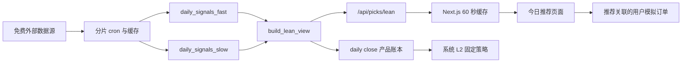
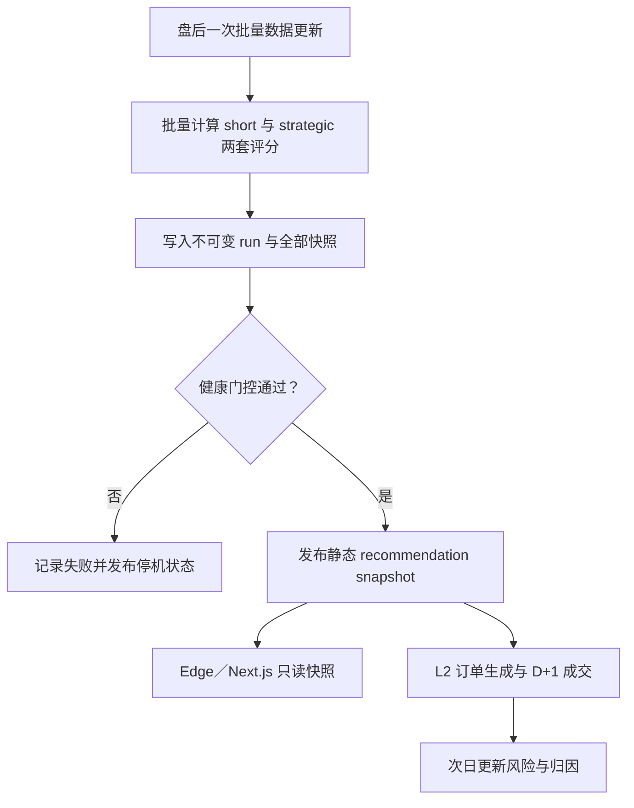

# Alpha Agent 量化产品与底层代码调查报告

> 调查日期：2026-07-31，Asia/Shanghai
> 审计基线：`main@bd43c7c9be07`
> 生产站点：`https://alpha.bobbyzhong.com`
> 审计视角：专业量化交易、产品管理、财务分析、数据分析
> 项目边界：个人研究项目、小型 Vercel 与 Neon 配置、免费或低成本数据、无实盘资金

## 一、执行摘要

### 1.1 总体判断

Alpha Agent 的工程底座已经明显超过一般个人量化项目。当前代码包含 14 个注册信号、154 个后端端点、20 个前端页面、40 个数据库迁移、717 个 Python 测试和 58 个前端测试。它已经具备单一信号注册表、覆盖率衰减、动态权重保护、append-only 产品账本、运行健康门控、因果 L2 模拟组合、用户模拟账户、回测、因子库、演化监控和 BRAIN 研究工作流。

但是，从专业量化交易员的标准看，平台目前仍然是一个研究与决策辅助系统，而不是可被稳定执行的投资建议系统。最重要的问题不是缺少更多信号，而是下面四件事还没有同时成立：

1. 用户看到的推荐必须来自同一个不可变、健康通过的市场运行。
2. 排序、置信度、持有周期和模拟成交必须使用一致的时间口径。
3. 推荐必须在数据不可用时明确停止，而不能静默显示旧结果。
4. 平台必须以成本后、基准后、风险调整后的前向表现证明推荐有用。

因此，建议把产品北极星从“生成更聪明的股票评分”调整为：

> 每个交易日生成一份可追溯、可复现、可拒绝发布的推荐快照，并用固定规则的前向模拟组合验证其成本后、基准后的真实效用。

### 1.2 当前最紧急的五项问题

| 优先级 | 问题 | 量化或产品影响 | 当前证据 |
|---|---|---|---|
| P0 | 生产页面在 API 失败时继续显示 7 月 18 日缓存，且没有过期警告 | 用户可能把 12 天前的推荐当成今日推荐 | 浏览器生产路径实测确认 |
| P0 | `mode=long` 先按短线分数执行 SQL `LIMIT`，再在子集内重排 | 长线榜单不是全市场真正的 Top N | `build_lean_view` 代码确认，现有测试未覆盖 |
| P0 | 模拟仓净值曲线把约 1,000,000 美元的账户净值与基准指数 100 放在同一纵轴 | SPY 曲线几乎不可见，比较在数学上无效 | 前后端代码确认 |
| P0 | 用户模拟仓用 UTC `date.today()` 作为信号日期 | 美股盘后下单在部分时段可能错误跳过下一交易日 | 订单与成交代码确认 |
| P1 | 生产调度在配额事故前约产生 515 次工作流端点调用／工作日 | 与 1 日、3 日、5 日、20 日、60 日信号周期不匹配，直接消耗小项目资源 | GitHub Actions 静态调度核算 |

### 1.3 建议的产品方向

建议把平台收敛为三个清晰层级：

1. **研究层**：因子、回测、演化和 BRAIN，用于产生和否证假设。
2. **决策层**：每日一次的不可变推荐快照，明确运行状态、持有周期、覆盖率、历史样本和组合风险。
3. **验证层**：系统 L2 固定策略验证推荐是否有用，用户模拟仓验证真实使用体验。两者共享来源追踪，但不能混为同一个绩效结论。

## 二、审计范围与证据等级

### 2.1 审计范围

本次调查覆盖：

* 数据摄取、缓存、数据库连接和生产调度。
* 14 个信号的注册、权重、周期与融合。
* 今日推荐的排序、评级、置信度、一致性和页面交互。
* 个股详情、选股、提醒、观察列表和方法论呈现。
* 因子回测、IC、权重自适应、因子库、演化和 BRAIN。
* 用户模拟仓、系统 L2 模拟组合、订单、成交、净值与归因。
* CI、测试、Vercel 部署、GitHub Actions 和 Neon 故障表现。

### 2.2 证据等级

| 等级 | 定义 | 本报告中的用法 |
|---|---|---|
| A | 生产路径直接复现或代码与测试共同确认 | 生产 API 500、旧缓存页面、路由完整性、CI、排序顺序 |
| B | 代码静态确认，但缺少当前生产数据验证 | UTC 交易日、净值轴、已实现但停用的 L2 调度 |
| C | 专业判断或待实验假设 | 信号经济含义、建议的阈值、预计资源节约 |

所有收益目标和优化收益均应视为待验证假设，不应被当作收益承诺。

## 三、当前地面真相

### 3.1 Git、测试与部署

| 项目 | 当前状态 | 结论 |
|---|---|---|
| 主干 | `main@bd43c7c9be07` | 本次审计基线 |
| 审计分支 | `codex/alpha-platform-quant-product-audit` | 与其他功能隔离 |
| 最新主干 CI | 2026-07-26，lint 与 test 均成功 | 工程回归基础良好 |
| 聚焦本地测试 | 推荐、用户模拟仓、L2、成交，共 21 项通过 | 核心已有行为可复现 |
| 前端生产部署 | `dpl_6aUSX993xoK4dpLtuHrMEHvnn4YV`，Ready | 2026-07-26 部署仍在线 |
| 生产路由 | 150 条，关键 picks、paper、L2 路由均存在 | 没有路由静默丢失 |
| 路由装载健康 | 24 个 router，失败数 0 | 后端导入完整 |

### 3.2 生产数据状态

生产 `/api/health` 返回 JSON 200，说明 Vercel 函数仍在线。但是生产 `/api/picks/lean` 返回 500，根因是 Neon data transfer quota exceeded。响应还包含了完整 Python 堆栈片段，构成不必要的信息泄露。

更严重的是，生产 `/picks` 页面仍能打开，并继续显示数据时间为 2026-07-18 的 50 条推荐。页面没有显示“数据超过 24 小时”的红色状态。直接 API 已经失败，但 Next.js 的旧数据缓存仍在被当作正常初始数据交给页面，因此形成了“服务看似可用，决策事实已失效”的状态。

### 3.3 调度状态

GitHub 上下列工作流当前均为 `disabled_manually`：

* `cron-shards`
* `daily-factor-loop`
* `earnings-finnhub`
* `insider-form4`
* `brain-mining-loop`
* `brain-backfill-selfcorr`
* `propose-job-runner`

因此，推荐、日价格、IC、L2、新闻、内部人交易和部分研究循环目前没有持续更新。它们被停用是合理的配额保护措施，但产品应该把该状态显示为“研究流水线暂停”，而不是继续显示“系统在线”。Neon 配额恢复和重新启用工作流应继续作为 8 月 1 日的独立 backlog task，不能通过本次报告假设它已经恢复。

## 四、平台模块审视

### 4.1 模块级结论

| 模块 | 已有优势 | 主要缺口 | 结论 |
|---|---|---|---|
| 数据与成员历史 | 有 SP500 历史成员、PIT 基本面、退市处理和数据质量页面 | 免费源故障、跨区访问、配额预算没有成为运行门控 | 基础较强，运营脆弱 |
| 信号注册表 | 14 个信号统一注册周期、权重、IC 与展示名 | 周期跨度 1 至 60 日，但推荐产品仍输出一个综合榜单 | 工程治理好，产品语义混合 |
| 融合与权重 | coverage damping、caps、guarded adaptive weights、版本化 policy | 默认权重总和 1.05，inversion guard 失败会静默失效 | 可用但需强化失效保护 |
| 今日推荐 | 双向榜、因子模式、驱动拆解、历史一致性、模拟入口 | 非原子快照、长线排序错误、旧缓存无告警、置信语义过载 | 当前首要改造对象 |
| 个股详情 | 归因、技术风险框、新闻和解释较完整 | 推荐来源 run ID 与状态未贯通至所有模块 | 适合作为二级分析页 |
| Screener／观察列表／提醒 | 支持用户自定义和快速筛选 | 与今日推荐、持仓风险没有形成统一任务流 | 保留，但降低一级导航权重 |
| 回测与因子库 | PIT、成本、beta、alpha、Newey-West、无前视测试较扎实 | 研究结果与每日推荐的真实政策仍存在距离 | 研究价值高 |
| Evolution／BRAIN | 有验证、审批、沙箱和大量测试 | 复杂度已超过当前前向证据的成熟度 | 冻结扩张，保留诊断能力 |
| 用户模拟仓 | 账户隔离、T+1、限价单、现金与持仓保护、推荐来源字段 | 时间、成本、绩效曲线、已实现盈亏和公司行动口径不完整 | UX 有价值，绩效暂不可依赖 |
| 系统 L2 | 不可变账本、先下单后读价格、固定策略、成本、SPY 基准 | 风险统计、成本敏感性、连续净值、状态展示尚未完整 | 最重要的真实性验证器 |
| 基础设施 | 路由健康、结构化 cron_runs、分片和重试较完整 | 工作流扇出过大、连接池偏大、停机降级不诚实 | 需要做减法 |
| 文档 | ROADMAP 对“先证明再扩张”判断正确 | README、ROADMAP 和 long-only 文档均有状态或逻辑漂移 | 影响可信度与维护效率 |

## 五、“今日推荐”专项审计

### 5.1 当前数据路径

设计方向是正确的：用户页面和产品账本共用 `build_lean_view`，系统 L2 只消费健康通过的不可变运行。问题在于，用户实时读取仍直接拼接可变的 fast 与 slow 表，而不是读取一个完整的 canonical run；同时页面缓存可以脱离当前后端状态继续存活。

### 5.2 P0：长线模式排序不正确

当前逻辑先在 SQL 中按存储的短线 composite 排序并执行 `LIMIT N`，然后才用 `factor.raw.z_long` 替换因子贡献并在 Python 中重新排序。因此，`mode=long&limit=50` 得到的是“短线 Top 50 中的长线重排”，不是全市场长线 Top 50。

举例：股票 A 的短线分数为 0.2，长线分数为 2.0；股票 B 的短线分数为 1.0，长线分数为 0.8。如果 SQL `LIMIT` 把 A 排除，之后任何 Python 重排都无法把 A 找回来。

建议：

1. 在生成运行时同时持久化 `score_short` 和 `score_long`，并分别生成全市场 rank。
2. 或在读取长线模式时先读取全部合格行，完成长线重算后再执行全局 Top N。
3. 新增反例测试，确保短线 Top N 之外的股票可以进入长线 Top N。
4. 在修复前，将长线按钮标注为“实验性子集重排”，或者暂时隐藏。

### 5.3 P0：旧缓存伪装成“今日”

后端的 `stale` 由响应行中最新的 `fetched_at` 计算。Next.js 把当时的整个响应缓存，包括当时的 `stale=false`。当后端后续因配额失败时，旧缓存继续被服务，但 `stale` 不会随当前时间重新计算。

这不是单纯的可用性问题，而是量化数据完整性问题。任何交易员都宁愿看到“今日无推荐”，也不应看到没有明确冻结标识的旧推荐。

建议采用双层保护：

1. 后端每天只发布健康通过的不可变 `recommendation_snapshot.json`，内含 `run_id`、`market_date`、`generated_at`、`data_cutoff`、`policy_id` 和健康门控。
2. 前端基于浏览器当前时间重新计算年龄，不能信任缓存中的布尔 `stale`。
3. 超过一个交易日后，将页面改为“冻结快照”，隐藏“高确信”措辞并禁用推荐关联下单。
4. 超过三个交易日或运行被停用时，默认显示停机面板，只允许查看历史快照。
5. 顶部“系统在线”应拆成 Web、数据、推荐运行、模拟成交四个独立状态。

### 5.4 P1：推荐不是一个原子市场快照

fast 与 slow 表分别选择每个 ticker 的最新行，再按 ticker 取较新的来源。这解决了陈旧 fast 行遮蔽更新 slow 行的问题，但榜单仍可能包含多个不同抓取时点和信号覆盖组合。`as_of` 使用可见结果里的最大时间，一个新行可以让榜单标题看起来新鲜。

页面的 per-row `partial` 和行级滞后徽标是有价值的补救，但“高确信”前三名卡片没有同等强度地展示完整性和数据年龄。对交易决策而言，跨股票可比性比某个单股分数的新鲜度更重要。

建议把发布单位从“最新行集合”改为“完整运行”：

* 一个 run 只有在覆盖率、价格、信号失败、基准、行业集中度和权重 policy 全部通过时才可发布。
* 每张卡显示相同 `run_id` 和 `market_date`。
* partial 行只能进入“数据待补”区，不能与完整行共用同一排名序号。
* 搜索可以返回 partial 股票，但必须显示“不参与今日排名”。

### 5.5 P1：评分、置信度与建议语言仍有错位

当前页面同时展示：

* `composite_score`：异质信号 z-score 的加权合成，不是预期收益。
* `agreement`：信号 z 的方差函数，衡量一致程度，不是统计置信区间。
* `confidence`：agreement 经历史方向命中率校准后的值。
* `consistency`：多个窗口的方向命中率。
* `BUY／OW／HOLD／UW／SELL`：由 composite 固定阈值映射。
* “买入／增持／减持／卖出”：面向用户的动作语言。

这是信息丰富，但认知负荷很高。尤其是“高确信”容易让用户把 agreement 误读为胜率或收益把握。生产实测的前三名 WDC、STX、FISV，模型一致性分别约为 61%、57%、78%，但校准命中率约为 51%、51%、66%，历史样本也不完整。

建议重命名并分层：

| 当前字段 | 建议展示 | 说明 |
|---|---|---|
| composite z | 模型排名分，附 rank percentile | 不暗示预期收益 |
| agreement | 信号一致度 | 明确只是输入之间的一致性 |
| confidence | 历史同类命中率，显示 `n` 和窗口 | 不使用“置信度”一词 |
| tier | 模型观点 | 与实际动作分离 |
| suggestion | 组合动作建议 | 只有通过组合约束和证据门槛才显示 |

在没有组合上下文时，`OW` 更适合显示为“模型偏多”，而不是“增持”。只有知道用户当前持仓、目标权重、行业暴露和风险预算后，平台才有资格说“增持 0.5%”。

### 5.6 推荐页目标形态

推荐页应围绕一个问题设计：“今天相对于昨日，有哪些经过健康门控的变化值得我采取行动？”

建议的信息顺序：

1. **运行状态**：市场日期、快照 ID、数据截止时间、覆盖率、是否冻结。
2. **组合结论**：建议持有多少只、预期换手、行业和 beta 变化、成本敏感性。
3. **新增与移除**：新进 Top N、退出 Top N、tier 改变，以及变化原因。
4. **候选明细**：rank percentile、模型观点、历史样本、风险、驱动和拖累。
5. **执行入口**：按目标权重生成模拟订单，而不是每行默认 10 股。
6. **事后验证**：该推荐快照的 D+1 成交、当前收益和对基准贡献。

## 六、量化研究与模型有效性

### 6.1 已有优点

平台已经具备若干值得保留的专业做法：

* SP500 历史成员掩码与退市股票保留，降低生存偏差。
* Compustat RDQ filing date 支持 PIT 基本面。
* 因子回测包含成本、turnover、beta、alpha 和 Newey-West t-stat。
* 信号有原生周期，并通过注册表统一治理。
* 自适应权重只以 10% 拉向证据，保留静态 prior 和回滚。
* 产品账本是 append-only，系统 L2 在读取执行价格前持久化订单。
* 缺失价格会产生显式 unfilled／exited 状态，而不是静默删除持仓。

这些能力构成真正的竞争资产。对于个人项目，最有价值的护城河不是数据规模，而是“推荐事实可重现，历史不会被重算改写”。

### 6.2 现有证据不支持强动作语言

`docs/long_only_factor_selection.md` 明确承认，3 年 SP500 面板上的 22 个经典 long-only 因子没有一个通过 `alpha-t > 1.0`。最佳 `ep` 也只有 `alpha-t=0.99`、`p=0.324`。这份诚实结论应该成为今日推荐的产品边界。

同一文档随后又声称 Top 6 “all picks satisfy all 4”，但候选表中这些因子的 Stage 2 全部标为未通过，且文档说 Stage 2 有 9 个 survivors。内部逻辑不一致会削弱整个平台的研究可信度，应重算或修正文档。

专业结论是：当前 composite 可以作为研究排序和选股注意力分配工具，但尚不能被解释为稳定的单股预期收益模型。平台应优先证明 rank spread 和固定组合表现，而不是继续强化 BUY／SELL 语气。

### 6.3 需要修正的统计口径

1. **不同周期信号混合**：premarket 1 日、news 3 日、technicals 5 日、factor 60 日被压成单一 5 日 policy。建议至少拆为 5 日 tactical 与 20／60 日 strategic 两个独立模型，不要只靠前端 mode 重排。
2. **校准样本相关性**：5 日 forward return 每天滚动，观测高度重叠。置信区间和有效样本量不能直接把每个 ticker-day 当独立样本。
3. **横截面与时间序列混合**：全股票、全日期汇总的方向命中率可能被市场上涨基准主导。必须报告相对 base rate 的 uplift，并按 regime、sector 和 market-cap 分层。
4. **阈值固定**：BUY／OW 阈值基于 composite z，而非历史 forward return bucket。应使用 walk-forward 训练区间建立 rank bucket，再在后续区间冻结验证。
5. **选择后偏差**：因子发现、筛选、权重和展示使用相同短历史时，容易发生 research overfitting。每次 policy 变更必须创建新版本，旧表现不能拼接。

### 6.4 建议的双轨验证

**产品组合**：每周调仓、long-only Top 50、等权、D+1 close、10 bps／side、SPY 与 RSP 双基准。它回答“用户是否应该信任推荐”。

**研究组合**：sector-neutral 的 top-decile minus bottom-decile，报告 gross、5／10／20 bps net、turnover、beta 和显著性。它回答“排名是否有横截面信息”。

两条曲线必须独立命名、独立 policy version、独立样本起点。研究组合有 alpha 不等于用户组合可执行，用户组合跑赢 SPY 也可能只是 beta 或行业集中。

## 七、产品指标体系

### 7.1 不建议使用单一虚荣指标

DAU、推荐点击率和下单量不适合作为单用户研究项目的北极星。它们可能奖励更刺激的建议，而不是更好的决策。建议使用“门控指标 + 结果指标 + 工作流指标”的组合。

### 7.2 一级门控指标

| 指标 | 定义 | 建议目标 |
|---|---|---|
| Complete Run Rate | 健康通过的交易日运行数／应运行交易日数 | 滚动 20 日不低于 95% |
| Silent Stale Incidents | 旧数据未明确标记却可下单的次数 | 必须为 0 |
| Full Coverage Rate | 完整 signal policy 权重覆盖率 | 核心权重不低于 90% |
| Price Eligibility | 推荐股票具有有效交易日价格的比例 | 100% |
| Reproducibility | 同一 run ID 重放后 rank、tier、payload 完全相同 | 100% |

门控失败时，不生成新的“今日推荐”。这比用旧数据补齐一个榜单更专业。

### 7.3 量化结果指标

| 指标 | 用途 | 最低披露要求 |
|---|---|---|
| Net excess return | 推荐组合相对 SPY／RSP 的成本后超额 | gross、5／10／20 bps 同时报告 |
| Information ratio | 超额收益稳定性 | 至少 126 个交易日给 provisional，252 日再作策略判断 |
| Rank IC／ICIR | 横截面排名信息 | 按 horizon、regime 和 policy version 报告 |
| Top-bottom spread | 排名区分度 | 行业中性与非中性并列 |
| Tier monotonicity | BUY 至 SELL 是否单调 | forward return、hit rate、n、turnover |
| Max drawdown | 用户损失体验 | 与 SPY 同期间比较 |
| Turnover／breakeven cost | 可执行性 | 显示成本盈亏平衡点 |
| Beta／sector concentration | 风险来源 | top sector、HHI、beta、active exposure |

### 7.4 工作流指标

| 指标 | 定义 | 作用 |
|---|---|---|
| Recommendation-to-paper rate | 健康推荐中产生关联模拟订单的比例 | 衡量推荐是否可理解和可行动 |
| Pick-linked fill rate | 推荐关联订单中成功成交的比例 | 发现价格、现金和订单规则问题 |
| Attribution completeness | filled order 具有 source run 与后续收益归因的比例 | 应为 100% |
| Time to decision | 打开今日推荐到确认模拟订单的中位时长 | 评估页面认知负荷 |
| Reversal／cancel rate | 用户短时间撤回订单的比例 | 发现误导性默认或信息不足 |

## 八、模拟仓与系统 L2 专项方案

### 8.1 两个模拟系统必须明确区分

平台当前有两个目的不同的模拟系统：

| 系统 | 用户模拟仓 `sim_*` | 系统 L2 `l2_*` |
|---|---|---|
| 目的 | 用户练习决策、验证交互 | 检验推荐 policy 是否有效 |
| 交易来源 | 推荐关联或用户手动 | 固定 canonical run |
| 规则 | 用户选择 ticker、数量和订单类型 | 预注册 Top N、权重、调仓、成本 |
| 结果解释 | 用户行为加模型共同结果 | 推荐系统的可审计前向证据 |
| 是否可用于评价模型 | 只能分来源后辅助判断 | 可以，是主要验证器 |

当前用户模拟仓的 attribution 只区分 pick-linked 与 self-directed，已经是正确起点。但关联键只有 `pick_date` 和 `pick_ticker`，应该升级为 `source_run_id`、`source_snapshot_id`、`policy_id` 和当时完整的建议 payload hash。

### 8.2 用户模拟仓的量化正确性问题

1. **净值与基准单位不同**：账户是美元，SPY 是 base 100，共用 Y 轴。应把二者都归一化为 100，或使用清晰双轴，但前者更易比较。
2. **美股交易日错误**：订单使用 UTC `date.today()`，应使用交易所日历和最后完成的市场 session。盘后订单的 signal session 不能只由服务器日期决定。
3. **已实现盈亏不完整**：账户接口只遍历 `qty > 0` 持仓并累加 realized PnL，完全卖出的 ticker 不进入汇总。应从所有 position 或独立 fill ledger 聚合。
4. **没有成本和滑点**：市场单按下一交易日 close 全量成交，用户曲线未扣费用。至少提供固定 5／10／20 bps 模型，并明确没有盘口、排队和冲击模拟。
5. **公司行动不足**：split、symbol change、merger、dividend 和 delisting 尚未形成用户账户的完整会计处理。
6. **reset 非事务化**：清仓、撤单和现金恢复是多个独立更新。应放入同一数据库事务，并为每次 reset 建立新的 account cohort，避免历史曲线拼接。
7. **现金没有预留**：多个 pending buy 可以同时通过提交检查，最后在 fill 时部分失败。可以保留这种现实规则，但 UI 要显示 reserved cash 和 batch priority。
8. **限价成交近似**：只用收盘价穿越判断并按 limit price 成交。应明确这是 close-cross proxy，不是历史真实成交。

成熟平台也明确披露模拟与实盘的差异。Alpaca 官方说明 paper trading 不覆盖 market impact、information leakage、latency slippage 和 queue position；QuantConnect 则把 fees、margin、fills、settlement 和 slippage 作为可配置的 reality models。Alpha Agent 不需要复制完整券商引擎，但必须同样明确披露自己的近似边界。[Alpaca Paper Trading](https://docs.alpaca.markets/docs/paper-trading)，[QuantConnect Paper Trading](https://www.quantconnect.com/docs/v2/cloud-platform/live-trading/brokerages/quantconnect-paper-trading)，[QuantConnect Slippage](https://www.quantconnect.com/docs/v2/writing-algorithms/reality-modeling/slippage/key-concepts)

### 8.3 推荐到模拟仓的一体化工作区

本地已有 `codex/alpha-paper-recommendation-loop` 分支，把四个割裂 tab 改为“推荐、下单、持仓、绩效和近期订单”的单页工作区，并补充公司名、最近收盘价和来源归因。这一方向符合真实任务流，也回应了此前四个页面互不关联的 UX 问题。

但是，该分支还没有部署，而且没有修复本报告发现的长线全局排序、旧缓存状态、UTC session、净值归一化和已实现盈亏问题。因此建议不要直接上线。先把它作为 Next 阶段的 UI 基线，合并 P0 正确性修复后再做生产验收。

### 8.4 L2 应补齐的最小风险面板

L2 不需要做成券商模拟器。它只需成为“无聊但可信”的测量仪器：

* NAV 与 SPY、RSP 均 base 100。
* gross、5／10／20 bps net。
* rolling 20／60／126 日超额收益与信息比率。
* turnover、beta、行业 HHI、最大行业权重。
* stale、missing、unfilled、forced exit 数量。
* 当前 policy version、样本起点、有效交易日数。
* bootstrap confidence interval，且明确相关样本的 block 长度。
* 所有 policy 变更后重新起一条曲线，不回填历史。

## 九、面向小服务器的基础设施优化

### 9.1 当前调度与信号周期不匹配

按 `cron-shards.yml` 静态核算，配额事故前每个工作日大约有：

| 工作 | 端点调用估算／工作日 |
|---|---:|
| technicals 全市场，每 15 分钟，8 个分片 | 224 |
| mid tier 每小时，15 个分片 | 105 |
| per-ticker news 每小时，8 个分片 | 56 |
| macro news，市场时段加 6 小时 backstop | 44 |
| full bootstrap，每 2 小时，6 个分片 | 24 |
| slow tier，每 4 小时，10 个分片 | 20 |
| minute bars，两次，8 个分片 | 16 |
| slow daily 双 sweep，7 个分片 | 14 |
| daily prices | 8 |
| IC annotation、methodology、L2 等 | 4 |
| 合计 | 约 515 |

这还没有计入每个端点内部的 ticker 和 provider 调用，也没有计入独立 Finnhub／Form 4 ingest。对于主要以 5 日、20 日和 60 日 forward horizon 验证的模型，这种扇出提供的决策增量很低。

### 9.2 推荐的极简运行架构

具体收敛建议：

1. 全市场核心推荐每天盘后运行一次。
2. intraday 仅保留 watchlist 和昨日 Top 20，最多开盘后与收盘前各一次。
3. 新闻 headline ingest 可以更频繁，但不应每次都触发全市场评分重算。
4. minute bars 只为进入事件研究样本的 ticker 拉取，不扫全市场。
5. 因子发现、methodology proposer 和 BRAIN 默认手动运行，或每周一次。
6. 每次完整成功后生成一个小型静态快照，页面读取不再依赖 Neon 每次在线查询。

保守估计，这可以把日常端点调用减少 90% 以上，同时让推荐时间口径更一致。

### 9.3 数据库与 API

* `asyncpg` 默认 `max_size=10` 对 serverless 多实例和 Neon 免费层偏大。建议使用 pooler、`min_size=0`、`max_size=2`，并为 singleton 初始化加锁，避免并发冷启动创建多池。
* 将今日推荐的 consistency、market context 和价格通过一至两个批量查询写进快照，不在每次用户访问时动态组装。
* 给每个 cron 建立预算字段：估算 rows read、rows written、egress bytes、provider calls 和运行秒数。
* 预算达到 70% 时降频，85% 时只保留 daily close，95% 时冻结发布并显式停机。
* `/api/picks/lean` 的异常响应只返回稳定错误码、公开 message、request ID 和 retry 状态，堆栈只进入服务端结构化日志。
* CORS 不应长期使用 `*`。限制到正式前端域名和本地开发 origin。

## 十、竞争基线与差异化

Alpha Agent 不应与完整券商或机构数据平台比规模，而应选取邻近产品的关键能力作基线：

| 邻近产品 | 行业基线 | Alpha Agent 可借鉴 | 不应复制 |
|---|---|---|---|
| QuantConnect | 费用、滑点、fill、margin、settlement、公司行动等 reality model | 明确成交假设并版本化 | 完整多资产券商引擎 |
| Alpaca Paper | 真实 API 工作流，同时明确模拟限制 | 把限制写进绩效和订单页面 | 接入实盘作为近期目标 |
| Portfolio123 | 排名系统、模拟、PIT 数据是核心价值 | 强化不可变排名快照与 PIT 证据 | 购买昂贵数据后追求大而全 |

QuantConnect 官方文档明确说明默认 paper model 甚至可能没有 slippage，这反而证明“模拟系统是否专业”不取决于模型多复杂，而取决于假设是否可见、可替换、可复现。Portfolio123 将 point-in-time ranking 与 simulation 作为核心定位，也支持 Alpha Agent 继续把产品账本视为核心资产。[Portfolio123](https://www.portfolio123.com/)

Alpha Agent 的潜在差异化是：

1. 单用户的推荐、解释、模拟持仓和归因可以形成非常短的闭环。
2. 信号级来源、权重、缺失、policy 变更和推荐 payload 可以完全追溯。
3. 可以诚实展示弱信号和失败运行，而不需要为了商业转化包装成高胜率产品。

它的结构性弱点是免费数据和单机资源。正确策略不是掩盖弱点，而是把“可暂停、可降级、不会静默撒谎”做得比大型平台更清楚。

## 十一、优化优先级

### 11.1 评分方法

优先级采用约束版 ICE：`Score = Impact × Confidence ÷ Effort`。Impact、Confidence、Effort 均为 1 至 5。Confidence 指证据确定性，不是模型胜率。个人项目每个阶段同时在制的高判断任务不超过 2 个。

| ID | 优化项 | Impact | Confidence | Effort | Score | 阶段 |
|---|---|---:|---:|---:|---:|---|
| Q1 | 旧缓存动态过期、冻结态、停止关联下单 | 5 | 5 | 2 | 12.5 | Now |
| Q2 | 修复 long mode 全市场排序，并加入反例测试 | 5 | 5 | 2 | 12.5 | Now |
| Q3 | 错误响应去堆栈，增加稳定 error code | 4 | 5 | 1 | 20.0 | Now |
| Q4 | 推荐页面读取 canonical run 静态快照 | 5 | 4 | 3 | 6.7 | Now |
| Q5 | 用户模拟仓 NAV 与 SPY 同基准归一化 | 5 | 5 | 1 | 25.0 | Now |
| Q6 | 修复美股 session date 与已实现盈亏 | 5 | 5 | 2 | 12.5 | Now |
| Q7 | cron 收敛为盘后全量加两次小范围 intraday | 5 | 5 | 3 | 8.3 | Now |
| Q8 | 把停止的 workflow 状态接入系统健康 UI | 4 | 5 | 2 | 10.0 | Now |
| Q9 | 把推荐、下单、持仓、绩效合并为单工作区 | 4 | 5 | 3 | 6.7 | Next |
| Q10 | source run、policy、payload hash 贯通订单与归因 | 5 | 4 | 3 | 6.7 | Next |
| Q11 | L2 补 5／10／20 bps、beta、sector、drawdown | 5 | 4 | 3 | 6.7 | Next |
| Q12 | tactical 与 strategic 两套独立模型与 rank | 5 | 3 | 4 | 3.8 | Next |
| Q13 | 交易成本、reserved cash、reset cohort | 4 | 4 | 3 | 5.3 | Next |
| Q14 | 公司行动与退市会计处理 | 4 | 3 | 4 | 3.0 | Later |
| Q15 | block bootstrap 置信区间与 regime 分层 | 4 | 4 | 4 | 4.0 | Later |
| Q16 | 实盘 broker 接入 | 2 | 1 | 5 | 0.4 | Won't do now |

### 11.2 Now，0 至 2 周

目标：恢复后首先确保平台不会显示错误的“今日事实”。

1. 修复 Q1、Q2、Q3、Q5、Q6。
2. 建立 canonical recommendation snapshot，至少包含 run ID、市场日、policy、覆盖率和健康状态。
3. 把工作流启停状态、Neon 配额状态和最近成功 run 接入统一健康端点。
4. 将 GitHub Actions 调度降频，在 8 月 1 日恢复前先计算新预算，再逐项启用。
5. 给推荐、缓存降级和模拟绩效增加端到端测试。

退出条件：

* 后端失败时，页面在 60 秒内明确显示冻结或停机，不再显示“高确信”。
* long mode 全市场反例测试通过。
* 订单 signal session 与美股交易日一致。
* 用户组合与 SPY 都以同一个 base 100 展示。
* 生产 API 不再返回 stack trace。

### 11.3 Next，3 至 6 周

目标：完成推荐到模拟持仓再到归因的单一闭环。

1. 以已有 `codex/alpha-paper-recommendation-loop` 为 UI 基线，合并正确性修复后上线。
2. 订单记录 source run、snapshot、policy 和 payload hash。
3. 推荐页由单股动作转为组合变更，显示 target weight、sector 和 beta 增量。
4. L2 展示 base 100 NAV、SPY、RSP、成本敏感性、turnover、drawdown 和异常数量。
5. 把 5 日 tactical 与 20／60 日 strategic 分成两个冻结 policy，独立产生 rank。

退出条件：

* 推荐、下单、成交、持仓、归因可以从同一个 run ID 完整追踪。
* 100% filled pick-linked orders 有来源和绩效归因。
* 用户可以在一个页面回答“为什么推荐、我做了什么、结果如何”。

### 11.4 Later，2 至 4 个月

目标：积累足够前向样本后，对模型做统计判断。

1. block bootstrap confidence interval、regime／sector／cap 分层。
2. 公司行动与退市会计处理。
3. 根据 incremental forward contribution 精简信号。
4. 只有在 L2 至少积累 126 个有效交易日后，才讨论 provisional 的 policy 变更。
5. 至少 252 个交易日、成本后证据和风险门槛同时通过后，才重新评估 L3。

### 11.5 现在明确不做

* 不新增更多 LLM 信号、GA 引擎或替代数据源。
* 不建设毫秒级实时行情或高频交易架构。
* 不接真实资金和 broker execution。
* 不用更多页面替代正确性修复。
* 不把弱 long-only 证据包装成目标价或预期收益。

## 十二、具体验收测试

### 12.1 今日推荐

1. 构造股票 A 在 short Top 50 外、long Top 50 内，`mode=long&limit=50` 必须返回 A。
2. 缓存快照超过 24 小时，即使后端不可达，页面也必须显示冻结且禁止关联下单。
3. 任意可交易榜单中的所有卡必须具有同一 `run_id` 和 `market_date`。
4. partial 股票可被搜索，但不具有榜单 rank 和动作 CTA。
5. inversion guard 查询失败时，run health 必须失败或降级，不能静默继续。

### 12.2 用户模拟仓

1. 账户从 1,000,000 涨至 1,010,000，曲线显示 100 到 101；SPY 同期也以 100 起点。
2. 美东盘后、UTC 跨日、周末和节假日下单都映射到正确 signal session 与 D+1 fill session。
3. 完全卖出最后一股后，realized PnL 仍计入账户总额。
4. reset 中途异常时，账户、订单、持仓不能处于半重置状态。
5. 两个 pending buy 竞争现金时，reserved cash 和最终失败原因都可见。

### 12.3 L2 与数据运行

1. 同一 run 重放得到相同 holdings、orders 和 NAV。
2. 缺失价格、死数据源和 forced exit 都进入指标。
3. 5／10／20 bps 三条 net 曲线可从订单和价格重新计算。
4. policy 变更生成新 series，不回写旧曲线。
5. Neon 达到预算阈值时自动降频，并生成可见状态事件。

## 十三、文档与治理修复

1. README 仍描述 A 股、CSI300、Streamlit 和旧 milestone，与当前美股、Next.js、FastAPI、PostgreSQL 和模拟交易系统不符，应重写。
2. ROADMAP 把 L2 scheduler 标为 deferred，但 GitHub Actions 已有交易日调度，应改为“已实现但当前手动停用”。
3. long-only factor 文档的 Stage 2 survivor 数与表格冲突，应由可重放脚本重新生成。
4. 每个生产能力应标注 `implemented`、`scheduled`、`enabled`、`healthy`、`user-visible` 五个状态，避免“代码存在”被误认为“产品可用”。
5. 所有研究报告应记录 dataset hash、code SHA、policy ID、运行时间和输出 hash。

## 十四、最终建议

Alpha Agent 现在不需要再证明它能做更多事情，而需要证明它能在资源受限时稳定地少做、做对、留下证据。

如果只能选择一条主线，应选择：

> 先修复今日推荐的全局排序和停机诚实性，再把推荐、模拟订单、持仓和归因接入同一不可变 run，最后让 L2 用至少半年到一年的成本后前向数据决定模型是否值得继续。

这条路径既符合专业量化流程，也符合个人项目的真实容量。它不会立刻让回测数字更漂亮，但会显著降低自我欺骗风险，并把每一份未来证据变成可累积的产品资产。

## 附录 A：关键代码证据

* 今日推荐聚合与 long mode：`alpha_agent/api/routes/picks.py::build_lean_view`
* 页面缓存：`frontend/src/app/(dashboard)/picks/page.tsx`
* 推荐交互：`frontend/src/components/picks/PicksBrowser.tsx`
* 信号注册表：`alpha_agent/signals/registry.py`
* 权重保护：`alpha_agent/fusion/guarded_weights.py`
* 运行门控：`alpha_agent/run_health.py`
* 产品账本：`alpha_agent/ledger.py`、`alpha_agent/storage/product_ledger.py`
* 用户模拟仓：`alpha_agent/api/routes/paper.py`
* 用户成交引擎：`alpha_agent/api/routes/cron_routes.py::_run_paper_fill`
* 系统 L2：`alpha_agent/backtest/l2.py`
* 调度扇出：`.github/workflows/cron-shards.yml`
* 研究证据：`docs/long_only_factor_selection.md`

## 附录 B：验证记录

* 生产 `/api/health`：200，JSON。
* 生产路由：150，picks、paper、L2 均存在。
* Router health：24 loaded，0 failed。
* 生产 `/api/picks/lean`：500，Neon data transfer quota exceeded。
* 生产浏览器 `/picks`：仍显示 2026-07-18 数据，无过期状态。
* GitHub Actions：核心数据与研究工作流均 `disabled_manually`。
* Vercel 前端：Ready，2026-07-26 部署。
* 聚焦测试：21 passed。

## 十五、2026-08-03 续审：24 小时稳定性不是数据正确性

本节在 Neon 配额恢复、P0 修复上线超过 24 小时后重新核验生产。结论分为两层：基础设施恢复通过，但用户可见的量化产品稳定性未通过。

### 15.1 基础设施复查

| 项目 | 当前证据 | 判断 |
|---|---|---|
| 后端健康 | `/api/_health` 返回 `db=ok`，slow cron 最近成功时间为 2026-08-02 13:30 UTC | 通过 |
| GitHub Actions | 8 月 1 日后抽取最近 37 次运行，失败 0、取消 0 | 通过 |
| Vercel | 8 月 1 日的前后端生产部署仍为 Ready，未观察到回滚 | 通过 |
| PostgreSQL 体积 | 约 164.5 MB，较恢复时增加约 3.8 MB | 正常 |
| Neon 本计费月流量 | 约 131.8 MB；按当前约 2.1 日速度线性外推约 1.9 GB／月 | 当前安全，但只是外推 |
| minute bars | 0 行 | 没有继续制造高成本数据 |

### 15.2 产品正确性复查

基础设施的绿色状态掩盖了一个更重要的失败：`daily_prices` 的最新市场日仍是 2026-07-23，而推荐信号在 2026-08-02 重新计算。生产 API 因只把股票价格与数据库自身的最近日期比较，仍返回 `stale=false`。这等价于“用旧行情重新计算出新信号”，不能被视为今日推荐。

进一步确认：

* 2026-08-01 的最新完整 `research_run` 被记成周六，而不是最近的 XNYS 交易日。
* 生产前 50 条当时全部为 `partial=true`，价格日全部为 2026-07-23。
* short 与 long 在全部 partial 的退化状态下返回相同前排结果。
* 页面仍显示“高确信”并允许进入推荐关联模拟下单。

因此本轮的 24 小时结论是：服务可用性通过，推荐可交易性失败。今后稳定性验收必须同时回答 Web、数据库、工作流、价格市场日、推荐 run、模拟成交六个问题，不能用 HTTP 200 或 `db=ok` 代替。

## 十六、第三方专业评审团队

本轮采用四个独立角色。前三个由独立 agent 只读审查，第四个由主审负责跨层约束。

| 角色 | 设立原因 | 核心判断 |
|---|---|---|
| 前端工程师与产品设计师 | 验证真实浏览器任务流、移动端、可访问性和状态表达 | 页面已有连贯骨架，但旧价格仍可下单、错误状态会伪装为空态，移动端推荐主操作被宽表格推到屏外 |
| 资深量化私募 VP | 判断研究证据是否足以支持产品声明与资金配置 | 当前应定位为研究原型与个人模拟工具，不是已验证 Alpha 产品；5 日证据接近噪声，20 日 IC 当前反向 |
| QR／QD／QT／风险工程师 | 检查研究、数据、交易和风控之间的交接契约 | PIT 与 walk-forward 基础不错，但数据熔断、成交并发、来源归因和风险预算尚未闭合 |
| 小型量化平台数据／SRE 架构师 | 这是个人项目，理想化机构方案若忽略服务器、配额和恢复复杂度就不可执行 | 应收缩为单一关键 DAG，将新闻与 LLM 降为非关键增强层，并以预算、幂等、可回放和显式停机为设计中心 |

### 16.1 团队共识

四个视角独立得出相同的优先顺序：

1. 不增加新因子，先让价格市场日成为全局硬门控。
2. 推荐页面只读一个不可变 run，搜索与 partial 数据不得获得今日排名和下单资格。
3. `agreement` 不是胜率，`composite` 不是预期收益，tier 不是交易动作。
4. 用户自主模拟仓与模型影子组合必须分开评估。
5. 小项目的专业性来自假设透明、失败可见和结果可重放，不来自高频调度或更多供应商。

### 16.2 前端与产品专项

已确认的体验与工程问题：

* `/picks` 冷启动单次观测 TTFB 约 2.6 秒，load 约 3.9 秒，页面约 1995 个 DOM 节点。
* 两次干净直达均出现 React `#425`、`#422` 水合错误，`toLocaleString()` 与客户端当前时间是重点排查对象。
* 390 px 视口需要横向滚动才看得到推荐表的模拟操作。移动端应该复用 `/paper` 的卡片表达。
* 页面没有语义化主标题；订单表单 label 关联、抽屉焦点管理、HoverTip 键盘访问仍不完整。
* 所有侧栏链接强制预取，冷启动观察到 13 个侧栏 RSC 预取，不符合小服务器预算。
* attribution、orders 或 curve 请求失败时，部分区域会显示为零值或“自主交易”，未知状态被错误地表达成已知空态。

### 16.3 量化 VP 专项

生产期证据不支持“稳定 Alpha”声明：

* 49 日 scoreboard 中 long basket 约 `+2.56%`，等权市场约 `+4.67%`，10 bps 成本后 long 约 `+1.38%`。
* 年化 alpha 虽为正，但 `alpha_t` 约 0.36，没有统计意义。
* 5 日 IC 约为零，20 日 IC 当前为负；修复后的前向样本远不足以晋级 policy。
* long-short spread 的正值主要来自空头篮子，不等价于用户可执行的 long-only 推荐创造 Alpha。
* scoreboard 的 SPY 累计收益异常接近零，必须先解释基准数据再使用任何相对收益结论。

因此在至少积累 60 个修复后 OOS 交易日前，页面应使用“研究候选，证据不足”。模型晋级建议仍维持更保守的 12 个月前向样本。

### 16.4 QR／QD／QT／风险专项

新增的高风险发现：

* 多个写入型 cron 同时支持公开 GET 与 POST，生产没有可见鉴权头。任何外部调用者理论上都可能触发昂贵任务或推进模拟成交。
* paper fill 先读取 pending 订单再逐笔更新，没有原子 claim 或 `FOR UPDATE SKIP LOCKED`。并发调用可能重复成交。
* 完全平仓 ticker 的 realized PnL 仍可能从账户总额中遗漏，因为账户查询只遍历 `qty > 0` 持仓。
* 当前 L2 权重使用 `1 / len(chosen)`，在不足 50 只时可能突破声明的 2% 单仓上限；它也没有按当前持仓计算 delta 订单。
* 回测 kernel 的持仓收益和换仓成本存在潜在一天错位，研究脚本又在 test slice 中选择最优参数，形成测试集选择偏差。
* 健康接口只覆盖少数 cron，信号 `last_success` 仍为空，不能证明关键 DAG 完整成功。

这些发现不改变本轮 P1 的实施边界，但其中公开 cron、成交并发和完全平仓盈亏属于新发现的 P0，应在继续扩展 L2 或增加研究功能前单独关闭。

## 十七、P1 实施方案与当前状态

### 17.1 原子推荐快照

本轮实现把产品账本发布从每一个 `fast_intraday` 分片内部移出。六个完整分片全部成功后，工作流才调用独立 `publish_recommendation`：

1. 用最新完成的 XNYS session 计算预期市场日。
2. 用 `daily_prices.max(date)` 计算实际市场日，不再使用服务器 UTC 日期。
3. 只有非 partial 且价格日等于市场日的股票获得 eligible 和 rank。
4. 同时持久化 short 与 long 的用户可见 payload。
5. 市场日、SPY、最小覆盖率任一门控失败时只记录 partial run，不发布为 canonical。
6. `/api/picks/lean` 默认读取最新 immutable complete run；搜索继续读取 live 行，但返回 `ranked=false`、`tradable=false`。
7. 每张可交易卡携带同一个 `run_id` 和 `market_date`；前端同时显示 run、市场日和覆盖率。

旧合法快照可以在故障时继续回看，但动态门控会返回 `tradable=false`。页面和模拟仓均冻结推荐关联下单，不回退到混合 live rows。

### 17.2 诚实的模型语言

本轮把五档用户文案从“买入／增持／观望／减持／卖出”改为“强偏多／偏多／中性／偏空／强偏空”，并同步做了以下调整：

* “高确信”改为“模型领先”。
* `composite` 改为“模型排名分”，明确不是预期收益。
* `agreement` 改为“信号一致度”。
* `confidence／consistency` 改为历史命中率表达，继续显示窗口与样本量。
* 只有模拟订单表单保留真实 buy／sell 动作，模型 tier 本身不再冒充组合指令。

### 17.3 调度预算

新的工作日静态预算为：

| 工作 | 新端点调用／工作日 |
|---|---:|
| slow daily 全市场加 annotation | 8 |
| 盘后完整 Top-240 加原子发布 | 7 |
| technicals，watchlist 加 Top 40，两次 | 2 |
| per-ticker news，Top 150，两次 | 4 |
| macro news | 4 |
| event minute bars，Top 75 | 1 |
| daily prices 加 IC | 9 |
| L2 | 1 |
| methodology 周均 | 0.2 |
| monthly IC 日均 | 0.03 |
| 合计 | 约 36.2 |

相对事故前约 515 次／工作日，静态端点调用减少约 93%。完整核心推荐每天盘后一次，盘中只保留两次小范围 technicals；新闻摄取不再自动触发全市场重算；methodology 从每天改为每周。

长任务不再使用会在超时后重放原请求的 `curl --retry-all-errors`。每个 fast shard 还以 GitHub run key 获取 PostgreSQL advisory lock，重复或重叠分片直接返回可观察的 no-op。

### 17.4 本轮验证门槛

在部署前必须满足：

* XNYS session 与 stale market-date 单元测试。
* canonical／frozen／search unranked API 集成测试。
* 分片不得写账本的回归测试。
* Python lint、前端 TypeScript、前端单测和 production build。
* 部署后验证 OpenAPI 新路由和响应字段、生产实际市场日、冻结 UI、工作流 schedule 与 GitHub enabled 状态。
* 只有恢复当天价格并成功发布一个健康 run 后，`tradable` 才能变回 true。

### 17.5 生产部署与验收结果

P1 主提交为 `1d4ce86`，生产浏览器验收后的冻结态补丁为 `9f02552`。两者均已进入 GitHub `main`。

部署证据：

* 后端 production deployment `dpl_LkNf9yZCKL9MEcgtpHCNDdnCoRUh` 为 Ready，别名包含 `alpha-api.bobbyzhong.com`。
* 最终前端 production deployment `dpl_98XVmP8Kgv3g5PzEsyRLZLbGZoj4` 为 Ready，别名包含 `alpha.bobbyzhong.com`。
* 生产 OpenAPI 已包含 `/api/cron/publish_recommendation`、`run_key`、`RecommendationRunState` 和扩展后的 `PicksResponse`。
* `/api/_health` 返回 JSON，`db=ok`。
* 默认 short 榜读取 immutable run 31，返回 `canonical=true`、`ranked=true`、`tradable=false`、`stale=true`。
* 该旧 run 的错误市场日仍是 2026-08-01，卡片价格日仍为 2026-07-23。新代码没有篡改历史账本，而是在读取时把它冻结。
* ticker 搜索和旧 run 不支持的 long 模式均返回 `canonical=false`、`ranked=false`、`tradable=false`。
* 生产浏览器 `/picks` 显示冻结横幅，不显示“模型领先”，50 个模拟按钮全部 disabled。
* 生产浏览器 `/paper` 显示冻结横幅和 `RUN #31`，桌面与移动两套 DOM 中的跟单按钮均 disabled。

第一次浏览器验收曾发现：非 tradable 的 long 探索视图虽然禁用了订单，却仍显示“模型领先”。补丁 `9f02552` 将任何 `tradable=false` 的视图统一纳入冻结状态。修复后复验通过。

截至本轮初次部署验收，当时未完成的不是 P1 代码，而是数据恢复后的首个健康发布。`daily_prices` 按新 schedule 在 22:00 UTC 更新，完整信号在 23:00 UTC 运行并原子发布。只有当实际市场日等于最近完成的 XNYS session、SPY 存在、完整股票价格覆盖率至少 95% 且最小 eligible 门槛通过时，生产推荐才会自动解除冻结。冻结期间系统的正确行为就是不提供可交易的“今日推荐”。

### 17.6 数据恢复与首个健康 canonical run

2026-08-03 已按新恢复路径完成首个健康发布，上述未完成项正式关闭。

1. GitHub Actions `30784245193` 完成 8 个 `daily_prices` 分片，全部 HTTP 200，错误数为 0，共补写 2,665 条价格记录；随后以 2,499 个样本对完成 IC 校准。
2. GitHub Actions `30784628650` 完成 6 个 Top-240 完整信号分片，合计写入 245 行，错误数为 0；最后一步只发布一个 immutable snapshot。
3. 新快照为 run 33，`market_date=2026-07-31`，等于当时最近完成的 XNYS session。健康门槛返回 `passed=true`，eligible 278，价格候选 278，`price_coverage=1.0`，`benchmark_fresh=true`，无拒绝原因。
4. 生产 short 与 long 榜均返回 `canonical=true`、`ranked=true`、`tradable=true`、`stale=false`，所有抽样卡片的 `run_id`、`market_date` 和 `price_date` 一致。AAPL 搜索视图仍保持 `canonical=false`、`ranked=false`、`tradable=false`。
5. 真实 Chrome 验收中，`/picks` 显示市场日 2026-07-31、快照 #33 和“模型领先”，50 个模拟按钮均解除冻结；`/paper` 显示 `2026-07-31 · RUN #33`，没有冻结提示，跟单按钮可用，未登录用户只在提交阶段进入登录门槛。

本次浏览器验收还确认了 Next.js 60 秒 ISR 的一个边界：缓存过期后的首次访问可以先返回旧页面，并在后台重验证；下一次访问才获得 run 33。它没有改变 API 或订单门控的正确性，但可能让刚发布后的用户短暂看到冻结态。后续 P2 可以在原子发布后增加显式 tag invalidation，或让客户端对比最新 run id 后自刷新，以消除这一短暂不一致。

run 33 首次健康发布的功能验收部署为：后端 `dpl_9qqTCHcwWpVJwzptKDTPrtb3sDV1`，前端 `dpl_BxX4HQqNKVxTf7aFnfkNuvrZSPhc`。报告与验收基线提交为 `c54b620`，本节记录的是其上线后恢复结果。部署 ID 会随报告类提交自动更新，因此当前生产别名与 Ready 状态应以每次交付时的生产路径复查为准。

## 十八、2026-08-03 P0 完整性问题关闭

第 16.4 节新增的三个 P0 已统一关闭，实施提交为 `ffafdd3`。修复没有引入新表、队列服务或常驻 worker，设计目标是适配 Neon 小数据库、Vercel Serverless 和个人项目的运维能力。

### 18.1 cron 写接口统一鉴权

所有 `/api/cron/*` 路由，包括原先位于独立 router 的 `ic_backtest_monthly`，现在统一要求 `Authorization: Bearer $CRON_SECRET`。服务端未配置 secret 时返回 503，缺失或错误 bearer 时返回 401，不会退化为公开接口。另增加无数据库读写的 `/api/cron/auth_check`，用于部署 smoke test。

生产调用方同步调整：

1. Vercel Cron 使用 Vercel 原生 `CRON_SECRET` bearer 约定。
2. `cron-shards`、`daily-factor-loop` 和 `propose-job-runner` 使用同一 GitHub Actions secret。
3. GitHub Actions 改为直连 `alpha-api.bobbyzhong.com`，不再为每个分片额外消耗一次 Next.js rewrite 调用。
4. 两个长任务移除传输层整请求重试，避免网络错误后重复执行昂贵 POST。

OpenAPI 生产核验覆盖 30 个 cron GET／POST operation，缺少 authorization header 的数量为 0。未授权 smoke 返回 401，授权 smoke 返回 200。GitHub Actions 运行 `30789509177` 在提交 `ffafdd3` 上通过相同链路获得 HTTP 200，队列为空时返回 `drained=0`，证明 secret、workflow 和生产后端契约一致。

### 18.2 模拟成交并发与资源上限

paper fill 采用两层数据库一致性边界：

1. 每次任务先申请 PostgreSQL 非阻塞 advisory lock。已有实例运行时，第二个实例立即返回可观察的 `already_running`，不等待，也不重复读取全表。
2. 每张订单在事务内用 `FOR UPDATE SKIP LOCKED` 重新确认仍为 pending。账户现金和持仓行也在修改前加锁，取消订单改为条件式原子状态转换。

为了控制 Neon 连接数、内存与 Vercel 执行时间，单次最多处理 200 张已有后续价格的订单，market 订单优先。价格查询只读取候选订单最早 signal date 之后的数据。整个任务最多同时占用一个任务锁连接和一个工作连接，没有新增数据库迁移或外部队列。

净值快照原先对每个账户反复查询持仓、最新价、已实现盈亏和 SPY，形成 N+1 模式。现在改为一个 PostgreSQL CTE 聚合读取和一个批量 upsert。它同时保留缺失最新价时按 avg cost 估值的保守口径。

### 18.3 完全平仓后的已实现盈亏

`/api/paper/account` 现在用一次带 account_id 索引条件的查询读取该账户全部 position，在内存中只把 `qty > 0` 的行作为当前持仓返回，但 realized PnL 对全部行求和。因此卖出最后一股后，历史已实现盈亏仍计入账户总额，且没有增加一次数据库往返。

同一口径也进入新的净值快照聚合：当前市值和未实现盈亏只计算活动持仓，已实现盈亏包含完全平仓 ticker。

### 18.4 验证与生产地面真相

| 门槛 | 结果 |
|---|---|
| 后端 API／cron／paper | 146 passed，3 条既有 pytest 标记警告 |
| 前端测试 | 63 passed |
| TypeScript | `tsc --noEmit` 通过 |
| Python lint | 变更文件 ruff 通过 |
| OpenAPI | snapshot 与生成类型同步，生产 cron 鉴权覆盖完整 |
| 后端 Production | `dpl_8D3Lq8HHzFjQuF5Y9AwqbbFHKxtm`，Ready，别名 `alpha-api.bobbyzhong.com` |
| 前端 Production | `dpl_FAbcyFN8VQWpz3yT2e9PAcPkoJcr`，Ready，别名 `alpha.bobbyzhong.com` |
| 推荐事实 | run 33，market date 2026-07-31，canonical／ranked／tradable 均为 true，price coverage 1.0 |

生产首次构建曾因 secret 文件末尾换行被 Vercel 拒绝，错误发生在构建阶段，旧 Ready deployment 继续服务，没有切换用户流量。随后去除换行并同步轮换 Vercel 与 GitHub secret，重新部署和真实 Actions 调度均通过。这个事件进一步确认：header secret 必须验证字节边界，不能把“环境变量名存在”当作部署可用。

因此，第 16.4 节的公开 cron、成交并发和完全平仓盈亏三个 P0 状态现为 closed。L2 单仓上限、回测时序、健康 DAG 覆盖等剩余发现仍按其原优先级保留，不因本节而被误报为已解决。

## 十九、2026-08-03 P1 真实性与可审计性关闭

本轮继续处理第 16.4 节中 P0 之后明确保留的问题，并同时关闭优先级表中的 Q10、Q11 与 Q13。实现仍以 Neon 小数据库、Vercel Serverless 和个人项目为约束，没有引入常驻 worker、消息队列、行情流或新的付费数据源。

### 19.1 L2 单仓上限与回测时序

L2 的声明参数 `max_position=0.02` 现在成为真实约束。可选股票不足 50 只时，每只仍不得超过 2%，未使用权重留在现金，不再把少数股票重新等权到满仓。SPY 之外新增 RSP 同期收益，用于区分市值权重和等权市场基准。

回测 kernel 将换仓成本、滑点和空头借券费对齐到产生下一期持仓收益的同一次决策，不再晚扣一个交易期。参数选择也不再读取 test slice：GA 适应度使用 train metrics，两个 long-only 研究脚本先按 train PSR、Sharpe 与 IC 选择参数，再把留出集只用于最终报告。这样仍不能消除所有研究者自由度，但关闭了代码内可复现的测试集选择泄漏。

### 19.2 推荐到订单的来源链与模拟仓记账

推荐关联订单现在必须同时提交 `pick_date`、`pick_ticker` 和 `pick_run_id`。服务端从 immutable `rating_snapshot` 验证完整且 eligible 的来源，再自行写入 `source_run_id`、`source_policy_id` 和 canonical payload SHA-256，浏览器不能伪造 policy 或 payload hash。

模拟仓新增以下会计边界：

1. pending 买单按参考价加 10 bps 预留现金，账户同时返回 settled cash、reserved cash 和 available cash。
2. pending 卖单预留股数，阻止多个未成交卖单合计超过当前持仓。
3. 买卖成交均记录 transaction cost；买入成本进入 avg cost，卖出费用从 realized PnL 和现金流中扣除。
4. reset 在同一事务中取消当前 pending 订单并递增 cohort。旧持仓、订单和净值继续保留在旧 cohort，不再通过改写历史行来制造一个“干净账户”。
5. 成交任务只处理账户当前 cohort，旧 cohort 的 pending 订单无法在 reset 后迟到成交。

这些字段通过一份 additive migration 加入，没有复制大表或回填历史 JSON。既有记录保留为 cohort 0，适合当前数据库规模。

### 19.3 L2 最小风险证据面板

`/api/l2/summary` 以只读轻量查询输出 base 100 NAV、SPY、RSP、成本后累计收益、beta、最大回撤、平均 turnover、5／10／20 bps 成本敏感性、异常订单数量、缺失价格数量和当前行业暴露。V039 之前没有 RSP 的历史周期明确返回 null 和“—”，不会伪装成 0% 横盘。模拟仓工作区在既有绩效区下方展示这组证据，不增加新导航或第二个交易入口。

UI 原则复查结果：数据不足时状态为 `accumulating`，不会伪装成可用绩效；中英文键同步；沿用现有 pane、字体和颜色约定；风险证据是辅助阅读区，不与下单主动作竞争。完整的新一轮导航、信息架构与视觉优化仍按用户指定留到旧报告问题关闭之后统一处理。

### 19.4 关键 DAG 健康证据

`/api/_health/signals` 不再把所有 `last_success` 固定返回 null，而是从已持久化 breakdown 计算各信号最后一次无错误产出时间。

新的 `/api/_health/dag` 覆盖 daily prices、full fast signals、immutable recommendation publish、L2、paper fill 和 monthly IC。价格任务必须在窗口内观察到至少 8 个完成分片，full fast 必须观察到至少 6 个完成分片，并且窗口内所有分片都成功；因此“最后一个分片成功”不能掩盖同批其他分片失败。接口明确区分 missing、stale、failed、incomplete 和 healthy，并返回 observed／required run 数量。

### 19.5 边界与后续项

当前 L2 仍以每个 signal date 的独立目标组合计算一段前向收益，而不是持久化一个连续 share-level 系统账户。因此“按当前实际持仓产生 delta 订单”没有被假装成已完成，它需要单独的 L2 position ledger、现金状态和历史口径迁移，保留为后续架构项。

Q12 的 tactical 与 strategic 两套独立冻结 policy 也没有通过复制现有权重来凑数。当前 long payload 可以独立重排，但在缺少足够 OOS 证据时，不应伪造一套看似独立的新模型。它继续遵守第十一节的晋级门槛。

### 19.6 本轮验证

本地门槛结果为：P1 聚焦后端与数据库、完整迁移链、L2 cron 与 OpenAPI 共 78 passed；生成的 TypeScript 契约已同步；Python lint 和 TypeScript 通过；63 个前端测试通过；Next.js production build 通过。production build 在隔离网络中预渲染 picks 时记录了既有后端 DNS 不可达日志，但构建完成且返回码为 0；生产部署仍需按真实域名、OpenAPI、数据库迁移和浏览器用户路径单独验收。
