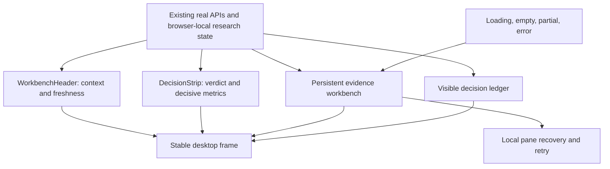

# Alpha Workstation Reference Alignment Work Record

Date: 2026-08-09

Branch: `codex/alpha-systematic-ui-upgrade`

Status: implemented and locally verified, not deployed

## Objective

Bring `/alpha`, `/backtest`, `/alerts`, and `/evolution` into close structural alignment with the approved native 1672 × 941 reference images while preserving real data contracts, authentication, failure semantics, and the resource limits of a personal project.

The authoritative visual contract is `docs/design-system/ALPHA-WORKSTATION-MASTER.md`. The reference image named “Factors” maps to `/alpha`; `/factors` remains Factor Zoo.

## Gap breakdown and closure

| Page | Previous mismatch | Implemented closure | Remaining data-contract limit |
| --- | --- | --- | --- |
| Factor Alpha | Static “server cache” health claim; experiment ledger lacked column hierarchy | Header now says whether data is awaiting or returned with a real run; ledger has explicit columns and reopen affordance | No real freshness timestamp, PIT badge, or server experiment ledger is exposed |
| Backtest | Idle state replaced the reference workbench with a large blank explainer; idle/running/error verdict geometry changed; diagnostics were single-tab | Idle and running retain the 2:1 chart/gate shell, comparison tray, and diagnostic summaries; every verdict state uses `DecisionStrip`; successful diagnostics use four accordions; recent runs capped at five | Cost sensitivity, concentration, and leakage rows remain unknown unless returned by the backend |
| Alerts | API failure erased the three-column triage surface; 3-column layout began only at 1680 px; research link visually outranked disposition; audit fixed to three rows | Three-column `0.9fr 2.2fr 1.25fr` grid begins at 1280 px; errors stay inside the queue pane; state actions are primary; audit can expand | Alert API exposes `source_count`, but not a source identifier, so source filtering was not fabricated |
| Evolution | Change ledger hidden in telemetry details; zero pending proposals changed the primary action; partial endpoint failures silently became “no data” | Change ledger is a visible bottom pane; “Review changes” remains the primary action; failed data sources are named locally; all-signal details have an explicit affordance | Dwell time and multi-event linkage are absent from current API data |

## Architecture after alignment

No database migration, new network dependency, polling loop, WebSocket, or additional compute job was introduced. The work is UI-state composition over existing data.

## Verification evidence

- Native references: `docs/design-system/references/alpha-workbench/proposed-*-native.png`, all 1672 × 941.
- Final local captures: `docs/design-system/validation/2026-08-09/*-1672x941.png`.
- `npx tsc --noEmit`: passed.
- `npm test`: 16 files and 70 tests passed.
- `npm run build`: passed. During static generation, the existing `/picks` page logged DNS failures for `alpha-agent-delta.vercel.app`, but the build completed successfully.
- 1440 × 900 browser check: all four routes reported `scrollWidth === clientWidth`, with no horizontal overflow.
- Alerts failure-state browser check: header, decision strip, navigation, filters, queue error and retry, inspector shell, and audit ledger all remained in the accessibility tree.

## Principles re-check

- Status remains visible and failed sources are named.
- One filled green primary action is retained per page.
- Error recovery is local rather than page-destructive.
- Empty states preserve the final workbench geometry.
- No illustrative number, curve, freshness, or provenance claim is presented as live truth.
- The same terminal tokens, pane borders, compact rows, and decision-first ordering apply across all four routes.

## Handoff

This branch has not been pushed or deployed in this work record. Production acceptance still requires commit identity, Vercel deployment and alias confirmation, backend health and OpenAPI completeness, frontend bundle configuration, authenticated custom-domain behavior, and a real Safari desktop check.
