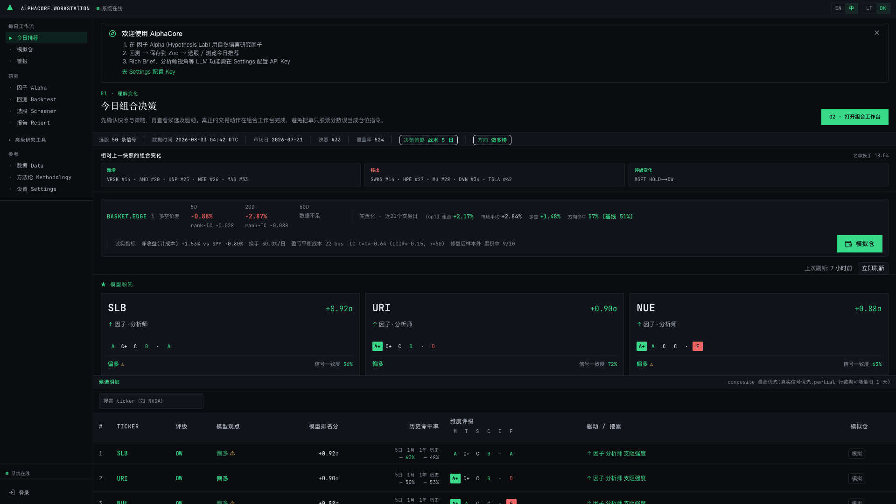
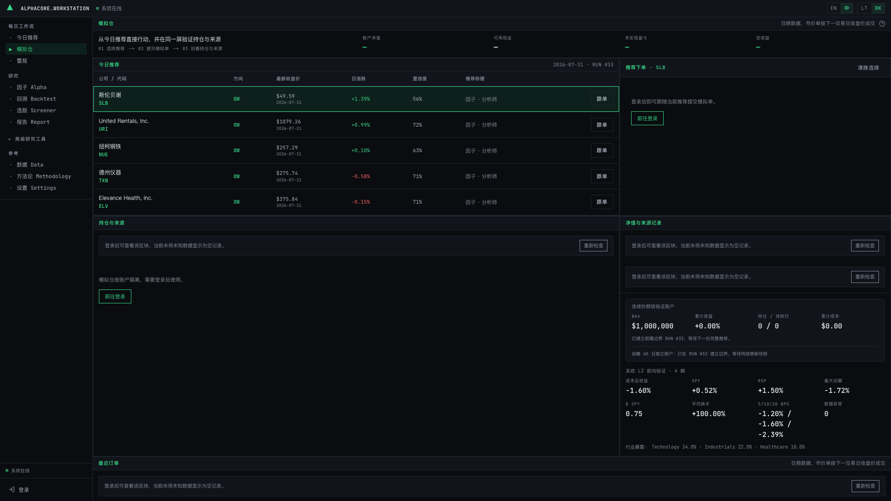
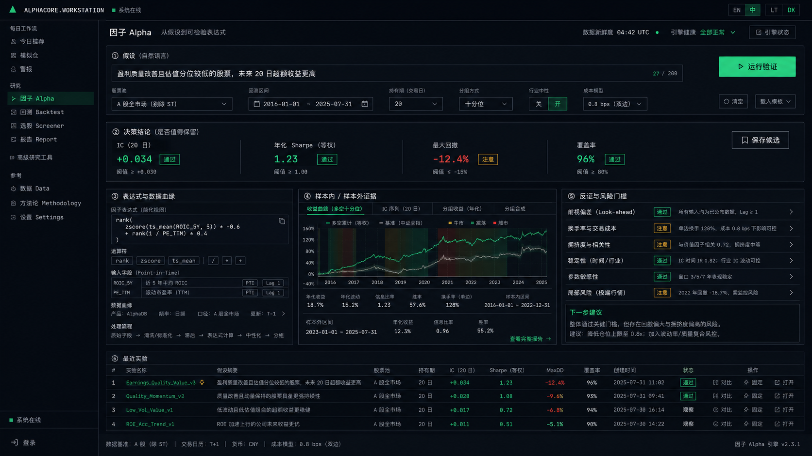
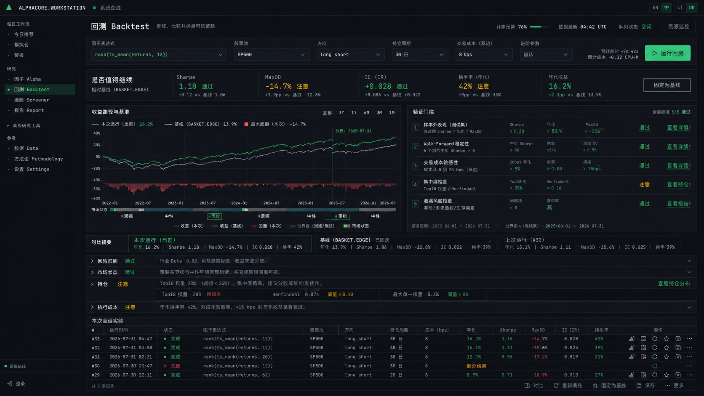
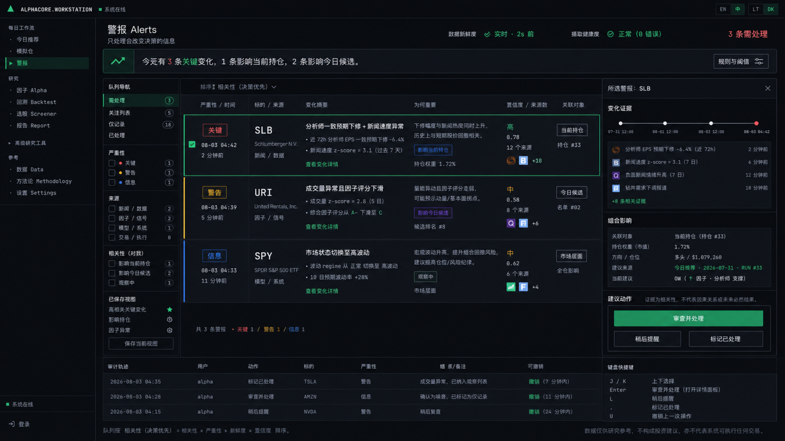
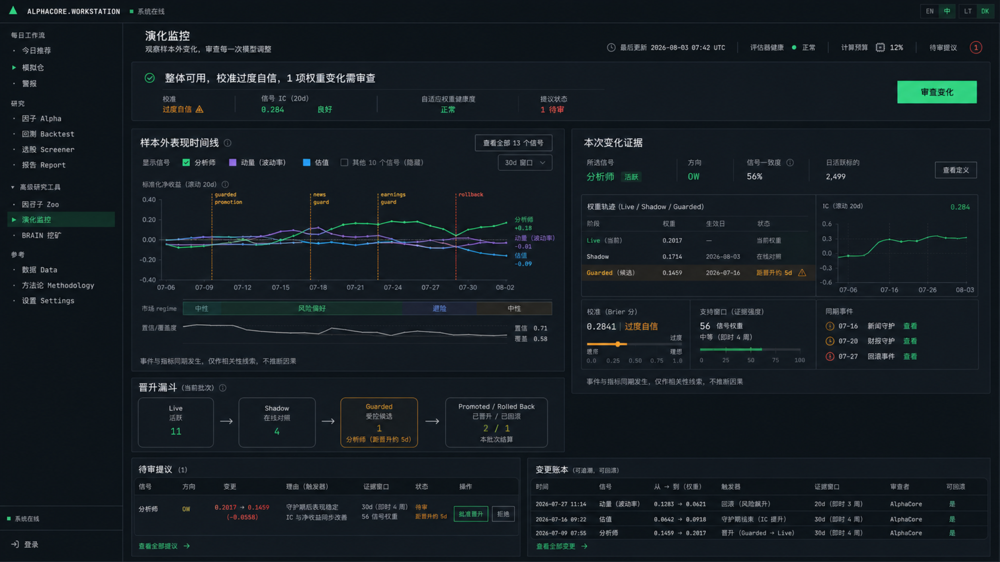

# Alpha Agent 桌面研究工作台统一重设计 Proposal

> 状态：Draft for review，不进入实现。  
> 日期：2026-08-03  
> 范围：`/alpha`、`/backtest`、`/alerts`、`/evolution`。  
> 参考基线：`/picks` 今日推荐与 `/paper` 模拟仓。  
> 目标设备：桌面端优先，基准视口 1440×900，重点审阅视口 1920×1080。移动端只保证不阻断，不作为本轮设计目标。

## 1. 结论摘要

本轮不建议继续做局部换肤。四个模块真正落后的地方，不是边框、字号或间距，而是它们仍以“输入表单、图表堆叠、原始日志”为页面骨架，没有像今日推荐和模拟仓那样围绕一次完整决策组织信息。

推荐采用统一产品方向：**一套研究工作站，四种决策模式**。

| 模块 | 页面要回答的问题 | 唯一 Primary Action | 默认产出 |
|---|---|---|---|
| 因子 Alpha | 这个假设是否值得保留？ | 运行验证 | 可追踪的候选因子 |
| 回测 Backtest | 这次实验是否经得住比较与反证？ | 运行回测 | 可比较的实验记录 |
| 警报 Alerts | 现在有什么变化真的需要我处理？ | 审查并处理 | 有审计轨迹的处理决定 |
| 演化监控 | 哪次模型变化需要审查、晋升或回滚？ | 审查变化 | 可逆的模型变更决定 |

设计不追求机构级“大而全”。Alpha Agent 是个人量化项目，服务器、数据库和算力都有现实上限，因此默认策略是：少量数据先聚合，细节按需加载，规则优先于在线 LLM，轮询优先于实时流，复用现有数据而非制造新的高成本管线。

## 2. 本轮设计边界

### 2.1 包含

1. 四个页面的信息架构、布局、交互与状态模型。
2. 今日推荐和模拟仓可复用的视觉、状态与行动语法。
3. 四张高保真桌面概念稿。
4. 跨模块跳转、证据血缘、审计轨迹与恢复路径。
5. 面向小型个人项目的技术约束和分期实施建议。
6. 可量化验收指标与设计原则复核。

### 2.2 不包含

1. 本轮不改运行时代码、不迁移数据库、不部署。
2. 不把移动端作为核心布局目标。
3. 不引入实时 WebSocket、在线 LLM 警报归因或大规模参数扫描。
4. 不把概念稿中的示例数字当作真实数据合同。
5. 不把生成图中的文字当作最终文案，实施时以 i18n 词条和真实字段为准。

## 3. 基线诊断

### 3.1 今日推荐与模拟仓为什么是正确基线

今日推荐先解释组合发生了什么变化，再给出决策策略、模型领先项和完整候选表。模拟仓把推荐、下单、持仓来源、净值证据和最近订单放在一条连续路径里。它们共同具备五个特点：

1. 先给用户一个判断框架，再展示证据。
2. 页面上始终能看见当前状态和数据时间。
3. 一个屏幕只有一个视觉上最强的下一步动作。
4. 关键对象可以跨模块继续行动，不是死数据。
5. 空状态、未登录状态和数据不足都明确说明，不伪装成完整结果。





### 3.2 四个旧模块的根因矩阵

| 模块 | 表面问题 | 根因 | 用户代价 |
|---|---|---|---|
| 因子 | 输入、判决和证据虽然已有分层，但仍像一次孤立工具调用 | 缺少实验比较、数据血缘和生命周期上下文 | 验证完仍要自己记住“为什么保留” |
| 回测 | 上方表单较新，下方仍有大量同权图表和折叠组 | 结果组织仍以指标类别为中心，不以反证和比较为中心 | 看到了许多数值，却不容易决定是否继续 |
| 警报 | 一张按时间排列的 ticker、type、payload 表 | 后端事件直接投影成 UI，没有决策相关性层 | 用户必须逐行翻译机器事件，且没有处理闭环 |
| 演化监控 | 13 条曲线同权、多个大图纵向堆叠 | 把 telemetry 当成产品，没有突出变化、证据和审批 | 看得见波动，看不出哪一项要处理 |

当前代码也印证了这一差异：`alerts.*` 只有约 13 个双语唯一词条，页面只加载最近 50 条并在客户端按类型过滤；`evolution` 已有 60 秒缓存和健康摘要，但默认仍同时展示大量信号；`alpha` 与 `backtest` 已拥有较完整的状态组件，却缺少跨实验和跨模块的统一上下文。

### 3.3 设计成熟度评分

评分维度来自本轮设计 gate。目标方案每项不得低于 7 分。

| 模块 | 产品哲学 | 视觉层级 | 细节完整性 | 功能闭环 | 有意义创新 | 目标均值 |
|---|---:|---:|---:|---:|---:|---:|
| 因子 | 8 | 8 | 8 | 8 | 8 | 8.0 |
| 回测 | 9 | 8 | 8 | 9 | 8 | 8.4 |
| 警报 | 9 | 9 | 8 | 9 | 9 | 8.8 |
| 演化监控 | 9 | 8 | 8 | 9 | 8 | 8.4 |

## 4. 产品愿景与策略校准

### 4.1 四个候选愿景

| 方向 | 定义 | 优点 | 风险 |
|---|---|---|---|
| A. 研究仪表盘 | 把更多研究数据压缩进一个屏幕 | 信息丰富 | 延续被动阅读和图表堆叠 |
| B. 个人 Quant OS | 覆盖研究、交易、监控的全功能操作系统 | 想象空间大 | 对个人项目过重，容易过度建设 |
| C. 决策链工作站 | 每个页面负责一个可完成、可追踪、可恢复的决定 | 与今日推荐、模拟仓一致，实施边界清楚 | 需要重做警报的数据语义层 |
| D. 机构级控制台 | 模拟基金公司的多角色审批与风控 | 专业感强 | 与单用户、小服务器现实不匹配 |

**选择 C：决策链工作站。** 它既能提高专业性，又不会把个人平台伪装成机构基础设施。专业感来自判断质量、证据诚实和流程闭环，不来自无止境增加面板。

### 4.2 主要用户与 JTBD

| 用户情境 | 核心 JTBD | 设计响应 |
|---|---|---|
| 每日研究前 | 快速知道哪些变化会影响今天的判断 | 警报按决策相关性分诊，并链接今日候选与当前持仓 |
| 形成新想法时 | 把自然语言假设变成可检验表达式 | 因子页把假设、表达式、血缘、门槛放在同屏 |
| 调参和复核时 | 比较本次结果、基线和上一次，而非孤立看指标 | 回测页以比较和反证为主轴 |
| 模型运行一段时间后 | 知道哪些样本外变化需要晋升、保留或回滚 | 演化监控突出待审变化与证据窗口 |

### 4.3 成功指标

| 指标 | 当前基线 | 提案目标 |
|---|---|---|
| 首次进入后找到 Primary Action 的时间 | 待测 | 5 秒内 |
| 从页面打开到形成下一步判断 | 待测 | 因子、回测 60 秒内，警报 20 秒内 |
| 一条关键警报完成处理所需点击 | 当前无闭环 | 3 次以内 |
| 回测时比较两次实验所需导航 | 依赖记忆和滚动 | 同屏完成 |
| 关键变化可回溯到证据窗口的比例 | 不完整 | 100% |
| 页面首屏同时竞争注意力的高权重区块 | 多处超过 8 | 不超过 5 |

## 5. 统一信息架构

四个页面共享同一套“决策工作台”骨架，但不会变成四张同构仪表盘。


### 5.1 共享页面语法

1. **Context Header**：页面任务、数据新鲜度、系统健康和资源预算。
2. **Decision Strip**：一句话回答“现在怎样”，并显示关键门槛。
3. **Primary Workbench**：承载本页最重要的证据和操作。
4. **Context Inspector**：解释选中对象的来源、影响和下一步。
5. **Decision Ledger**：保存实验、处理、晋升、回滚等可追踪记录。
6. **One Primary Action**：每页只有一个实心绿色按钮，其他动作全部降级。

### 5.2 跨模块对象模型

核心对象不再在页面之间丢失：

`hypothesis_id → factor_spec_id → backtest_run_id → model_change_id → alert_id → recommendation_run_id → paper_order_id`

首期不要求一次性补齐全链路数据库外键。UI 至少要携带可用的对象 ID、时间戳和来源标签，并对缺失关联显示“未关联”，不得凭语义猜测。

## 6. 因子 Alpha：Factor Decision Workbench

### 6.1 设计目标

当前 `/alpha` 已经具备假设输入、渐进式验证、判决条和证据 pane，这些正确资产应保留。本轮提升的重点不是推翻现有流程，而是把一次验证升级为一段可比较、可追踪的研究记录。

页面最终让用户记住的是：“我验证了一个假设，知道它为什么暂时值得保留，也知道下一次要反驳什么。”

### 6.2 布局结构

1. 顶部保留自然语言假设输入，股票池、区间、持有期和成本模型进入同一上下文。
2. Primary Action 固定为“运行验证”。“保存候选”只在至少获得 IC 后出现，使用次级样式。
3. 判决条同时显示原始数值、阈值和判定，避免只有绿灯没有理由。
4. 主工作区分为三列：表达式与数据血缘、样本内与样本外证据、反证与风险门槛。
5. 最近实验放在底部，支持比较、固定、重新打开，不默认自动重跑。



> 图稿说明：原生生成文件为 1672×941，4K 审阅版为 3840×2160。最终组件和文案以真实数据合同为准。

### 6.3 信息优先级

| 层级 | 默认内容 | 延后内容 |
|---|---|---|
| L0 | 假设、运行状态、判决、保存候选 | 无 |
| L1 | 表达式、血缘、样本外证据、关键反证 | 无 |
| L2 | 行业稳定性、拥挤度、成本敏感度、历史比较 | 折叠或按需打开 |
| L3 | LLM provenance、完整 AST、完整窗口明细 | Drawer |

### 6.4 交互与恢复

| 状态 | 页面反馈 | 恢复路径 |
|---|---|---|
| idle | 示例假设与参数解释 | 填写后运行 |
| translating | SPEC pane 渐进填充，焦点位置显示阶段 | 可取消，不丢失输入 |
| partial | 已获得的表达式或 smoke 结果保持可见 | 仅重试失败阶段 |
| stale | 判决冻结，并标记数据日期 | 更新数据后再运行 |
| error | 显示失败阶段、原因和可操作建议 | 编辑输入或阶段重试 |
| saved | 显示候选 ID 与来源 | Toast 中可撤销 |

### 6.5 与现有实现的关系

保留 `useAlphaChain`、`HypothesisInputCard`、`VerdictBar`、`EvidencePaneGrid` 和 `AnalyticsAccordion` 的状态资产。新增的主要是实验上下文、血缘摘要、对比历史和跨模块对象链接。无需把 LLM 或回测改成实时流式服务。

## 7. 回测 Backtest：Experiment Validation Cockpit

### 7.1 设计目标

现有 `/backtest` 已经完成过一次正确的结构化改造，具有 sticky form、verdict bar、evidence grid 和 recent runs。当前问题是视觉上仍存在“上半屏是新工作流，下半屏是旧分析仓库”的断层，而且空状态会留下大量巨型空 pane。

本轮把重点从“展示所有回测输出”改为“比较本次实验，并寻找足以否定它的证据”。

### 7.2 布局结构

1. Sticky setup strip 只保留高频参数，展示预计耗时和计算成本。
2. 判决条默认比较当前、固定基线和上次运行，delta 不依赖用户心算。
3. 主工作区采用 2:1：左侧收益路径与基准，右侧验证门槛。
4. 风险归因、市场状态、持仓、执行成本变成摘要式折叠组，只有越过门槛的组自动展开。
5. 本次会话实验表始终位于页面下部，支持重填、比较、固定和保存。



> 图稿说明：原生生成文件为 1672×941，4K 审阅版为 3840×2160。

### 7.3 判决模型

判决不是单一综合分，而是五个透明门槛：

| 维度 | 默认判断 | 呈现原则 |
|---|---|---|
| Sharpe | 是否具有基本风险调整后收益 | 同时显示原值和基线 delta |
| MaxDD | 是否超出用户可承受范围 | 越接近 0 越好，避免方向误读 |
| IC | 排序能力是否为正且稳定 | 样本外优先于样本内 |
| Turnover | 收益是否被成本侵蚀 | 必须绑定当前成本模型 |
| Annual Return | 结果是否有经济意义 | 不允许掩盖回撤和换手 |

### 7.4 资源约束下的交互

1. 不做自动大规模参数 sweep。首期只提供“复制本次参数”和小范围手动比较。
2. 同一用户同时只允许一个重型回测运行，队列状态在按钮旁可见。
3. 最近实验默认只保存指标摘要和参数快照，完整曲线按需读取。
4. 图表首屏只绘制当前、基线和 benchmark，其他运行在用户选择比较后再加载。
5. 运行失败时保留已完成的 partial result，不清空整个页面。

### 7.5 空、错和长任务状态

空状态不再渲染十几个空图表。页面只显示一张轻量引导卡和最近实验。运行超过 1 秒显示阶段，超过 3 秒显示当前步骤；失败时明确指出参数校验、数据缺口、计算超时或服务不可用，并给出对应恢复动作。

## 8. 警报 Alerts：Decision Triage Queue

### 8.1 为什么这是最高优先级

当前 `/alerts` 是四个模块中问题最严重的页面。它把最近事件按时间映射成四列表格：时间、ticker、类型、payload。虽然已有去重、ticker 深链和关注列表标记，但用户仍要自己完成四次翻译：发生了什么、严重吗、与我有关吗、下一步怎么办。

新警报页必须从“通知档案”变成“待处理决定”。排序对象不是事件时间，而是：

`triage_score = 决策相关性 0..40 + 严重性 0..25 + 新鲜度 0..20 + 证据置信度 0..15`

每一项都必须可解释。首期使用确定性规则，不调用在线 LLM 生成优先级或因果说明。

### 8.2 三栏工作台

1. 左栏是队列导航和保存视图：需处理、关注列表、仅记录、已处理。
2. 中栏是结构化警报队列。每行显示“变化摘要、为何重要、证据数量、关联对象”，不直接暴露原始 payload。
3. 右栏是选中警报的证据、组合影响和建议动作。
4. Primary Action 是“审查并处理”。“稍后提醒”和“标记已处理”为次级动作。
5. 底部保存审计轨迹和撤销窗口。



> 图稿说明：原生生成文件为 1672×941，4K 审阅版为 3840×2160。图中的组合关联仅用于表达结构，不代表线上已有对应记录。

### 8.3 警报数据语义

| 字段 | 来源 | 首期策略 |
|---|---|---|
| severity | 事件类型与阈值规则 | 后端或共享库确定性映射 |
| decision_relevance | 当前持仓、今日候选、关注列表、市场层级 | 对最近 50 条做轻量关联 |
| freshness | `created_at` | 时间衰减，显示原始时间 |
| confidence | 独立来源数、数据完整度 | 不把模型分数伪装成事实概率 |
| why_it_matters | 规则模板与关联对象 | 模板化，不由 LLM 猜因果 |
| evidence | 原始事件与真实来源 | 保留可展开明细 |
| status | open、snoozed、resolved | 窄状态表持久化 |

建议增加一个窄表或等价持久层 `alert_triage_state`，仅保存 `alert_id`、`status`、`snooze_until`、`resolved_at`、`updated_at` 和可选备注。它不复制市场数据，不做全量快照，索引只覆盖最近 open 状态和 alert ID，适合小型 Neon 实例。

### 8.4 分诊与处理规则

1. 影响当前模拟仓持仓的关键变化优先于普通关注列表事件。
2. 影响今日候选的事件优先于无关联 ticker。
3. 市场层级事件单独标记，不伪装成单票原因。
4. 同 ticker、同类型、同一小时内继续聚合，但保留来源数量和时间范围。
5. resolve 后提供短时 Undo，不弹确认框。
6. 证据不足时只能标记“信息不足”，不得自动输出买卖结论。

### 8.5 状态与恢复

| 状态 | 界面 | 恢复 |
|---|---|---|
| loading | 保留队列轮廓和上次更新时间 | 自动完成或手动重试 |
| partial | 显示已加载警报，缺失关联标注“未关联” | 单独重试上下文关联 |
| stale | 顶部警告源数据过期，禁用强行动词 | 刷新数据源 |
| empty | 明确区分“没有关键警报”和“抓取失败” | 查看仅记录或重试 |
| error | 保留旧队列，只在当前焦点显示错误 | 重试，不清空处理状态 |
| resolved | 移出默认队列并记录操作者与时间 | Undo 或从已处理恢复 |

## 9. 演化监控：Model Change Observatory

### 9.1 设计目标

现有页面已经有健康度条、IC 趋势、校准、权重和变更记录，数据资产足够。主要问题是 13 条信号曲线同权竞争，多个大图纵向堆叠，用户要先成为 telemetry 分析师，才能知道是否需要审查变化。

新页面把“待审变化”提升为主对象。健康摘要先说结论，时间线只突出三条决策相关信号，其余默认弱化；右侧围绕选中变化展示证据窗口和同期事件。

### 9.2 布局结构

1. 顶部一句话总结整体健康和待审事项，Primary Action 为“审查变化”。
2. 主区左侧是样本外表现时间线，默认选中最需要处理的信号。
3. 主区右侧是本次变化证据，包括 Live、Shadow、Guarded 权重、IC、校准、支持窗口和同期事件。
4. 晋升漏斗显示 Live、Shadow、Guarded、Promoted 或 Rolled Back 的数量与停留时间。
5. 底部并列待审提议和变更账本，每次变化都有证据窗口、审查者和回滚状态。



> 图稿说明：原生生成文件为 1672×941，4K 审阅版为 3840×2160。

### 9.3 Traceability 约束

时间序列中的变化只允许关联到真实共现记录，例如配置变更、guard 启停、新闻窗口、财报窗口、宏观事件和 rollback。文案统一使用“同期事件”或“相关性线索”，禁止写成“因为某新闻导致 IC 下降”。

### 9.4 性能策略

1. 延续现有 60 秒 revalidate，不引入持续推流。
2. 默认只绘制 3 条重点信号，其他信号按需加载或弱化。
3. 权重和变更表分页或虚拟化，首屏只取最近记录。
4. 证据详情点击后再请求，不在服务端首屏聚合所有历史窗口。
5. 图表下采样到视口像素密度，原始序列仍可在详情导出。

### 9.5 审查动作

“审查变化”打开 inspector，而不是直接批准。批准、拒绝和回滚均为可追踪的次级动作。批准后显示短时 Undo；涉及不可逆数据重算时才使用显式确认，并说明影响范围。

## 10. 共享视觉与交互规范

### 10.1 桌面布局

| 项目 | 规范 |
|---|---|
| Sidebar | 复用现有宽度和分组，不改路由 |
| 内容区 | 12 栏流式网格，最小有效宽度 1180px |
| Header | 52 至 64px，任务和状态同一行 |
| Decision Strip | 88 至 132px，根据状态最多两行 |
| 主工作区 | 因子 1:1:1，回测 2:1，警报 1:2.5:1.4，演化 2:1 |
| Pane 间距 | 8 或 12px，避免大面积无意义留白 |
| 表格行高 | 32 至 44px，依信息密度分级 |

1440px 以下允许 inspector 变成右侧 drawer，但不为手机重新设计信息架构。1920px 以上增加证据宽度，不扩大标题和卡片圆角。

### 10.2 视觉语法

1. 继续使用近黑背景、细规则线和 `tm-*` token。
2. `font-tm-mono` 用于 pane chrome、标签和正文，`font-mono` 仅用于表达式和数字表格。
3. 实心绿色只表示当前页面 Primary Action。通过状态使用文本、细边框或小状态块，不与 Primary Action 竞争。
4. 黄色表示需要审查，红色表示错误或越界，蓝紫等颜色只用于图表系列和信息分类。
5. 不使用玻璃拟态、发光渐变、巨型 KPI 卡、浮夸图标和无含义装饰。
6. 图表默认标注单位、窗口、基准和数据截止时间。

### 10.3 统一状态合同

所有异步 pane 使用同一状态集合：

```ts
type PaneState =
  | { kind: "idle" }
  | { kind: "loading"; stage?: string; startedAt?: string }
  | { kind: "partial"; data: unknown; missing: string[] }
  | { kind: "ready"; data: unknown; asOf: string }
  | { kind: "stale"; data: unknown; asOf: string; reason: string }
  | { kind: "error"; previous?: unknown; message: string; retryable: boolean };
```

错误不得把旧数据清空。`stale` 与 `error` 必须区分。任何超过 100ms 的状态变化在当前视线位置反馈，超过 3 秒的任务显示阶段名称。

### 10.4 键盘与高效操作

桌面用户可使用 `/` 聚焦搜索，`J/K` 移动队列或表格选择，`Enter` 打开 inspector，`Esc` 返回，具体 state-changing 快捷键必须二次显式按键或提供 Undo。快捷键只是加速器，不能成为唯一操作路径。

## 11. 技术可行性与资源预算

### 11.1 预算原则

| 资源 | 设计约束 | 建议上限 |
|---|---|---|
| 数据库 | 不复制市场明细，不对历史表做首屏全量 join | 首屏查询 3 至 5 个，均有时间或状态索引 |
| 后端 CPU | 警报排序和文案模板使用确定性规则 | 每次最近 50 条以内 |
| 前端 CPU | 默认限制图表系列和点数 | 首屏图表每 pane 约 1,500 点以内 |
| 网络 | 摘要先行，详情按需 | 首屏 JSON 目标小于 250KB，不含图像 |
| LLM | 只用于用户主动发起的研究流程 | 警报分诊和监控说明不在线调用 LLM |
| 刷新 | 复用缓存和手动刷新 | 演化 60 秒，警报 60 至 300 秒或手动 |

### 11.2 两个最小架构增量

1. **Decision Context Resolver**：接收 ticker、对象 ID 和时间窗，返回它是否关联当前持仓、今日候选、关注列表或某次实验。首期只查询最近、当前对象，可做 60 秒缓存。
2. **Decision Ledger**：统一表达实验固定、警报处理、模型批准和回滚。无需立即建通用大表，先定义共享 UI contract，各模块使用自己的窄持久层，待字段稳定后再收敛。

### 11.3 不推荐的方案

1. 不让 LLM 为每条警报生成摘要、优先级和因果解释，成本高且不可审计。
2. 不在演化页默认拉取所有信号的所有窗口。
3. 不在浏览器保存唯一的关键审计状态。
4. 不为“实时感”引入 WebSocket，当前数据更新频率不需要。
5. 不一次性重写四个后端接口。先稳定共享前端合同，再补必要字段。

## 12. 方案取舍矩阵

| 方案 | 决策效率 | 实施成本 | 服务器负担 | 可追踪性 | 推荐 |
|---|---:|---:|---:|---:|---:|
| 只统一视觉 token | 2 | 2 | 1 | 1 | 否 |
| 四页分别做局部布局优化 | 5 | 5 | 3 | 4 | 否 |
| 统一决策工作台，按模块分期 | 9 | 7 | 4 | 9 | 是 |
| 一次性建设 Quant OS | 8 | 10 | 9 | 9 | 否 |

SCAMPER 复核后的关键选择：

1. **Substitute**：用判决条替代 KPI 卡堆叠。
2. **Combine**：把变化证据、对象影响和处理动作放入同一 inspector。
3. **Adapt**：复用今日推荐的组合变化摘要和模拟仓的来源链。
4. **Modify**：把图表从默认全量改为决策相关信号优先。
5. **Put to another use**：把 recent runs 从历史表变成比较基线。
6. **Eliminate**：删除无行动价值的刷新主按钮和巨型空 pane。
7. **Reverse**：警报不再从事件出发，而从“需要我决定什么”反向组织。

## 13. 分期实施建议

### Phase 0：共享合同与设计系统，低风险

1. 固化 `DecisionStrip`、`ContextInspector`、`PaneState` 和 Primary Action 规则。
2. 补齐四页 i18n 词条清单和视觉 token 使用清单。
3. 建立桌面 1440×900 与 1920×1080 的视觉回归基线。
4. 不改变 API 行为。

### Phase 1：警报，最高价值

1. 先实现队列分层和 inspector，仍使用最近 50 条数据。
2. 加入规则化 severity、relevance 和 evidence 映射。
3. 增加窄 `alert_triage_state` 持久化和 Undo。
4. 验证与当前持仓、今日候选的轻量关联查询。

### Phase 2：演化监控

1. 重排健康摘要、重点信号和待审变化。
2. 限制默认曲线数量，详情按需。
3. 统一同期事件和变更账本，不增加 causal copy。

### Phase 3：回测

1. 把现有组件重排为 comparison-first 结构。
2. 优先消除空 pane 和同权折叠组。
3. 最近实验只保存摘要，详情按需。

### Phase 4：因子

1. 在不破坏现有 `useAlphaChain` 的前提下补血缘、反证和实验比较。
2. 建立到回测和 Zoo 的对象链接。
3. 最后统一四页的 ledger 与 inspector 细节。

这一次的实施顺序故意从警报开始，因为它的产品欠债最大，同时可以最早验证统一工作台是否真的提升决策效率。

## 14. 验收标准

### 14.1 用户旅程验收

| 旅程 | 通过条件 |
|---|---|
| 因子 | 从输入假设到看到判决、血缘和下一步，不需要离开页面 |
| 回测 | 同屏比较当前、基线和上次运行，并能说明哪项证据支持或反驳继续研究 |
| 警报 | 从打开页面到处理一条关键警报不超过 3 次点击，处理后可撤销 |
| 演化监控 | 用户能在 10 秒内指出唯一待审变化，并打开真实证据窗口 |
| 跨模块 | 至少能从警报进入关联持仓或候选，从因子进入带参数的回测 |

### 14.2 工程验收

1. 1920×1080 首屏无主要内容横向溢出，1440×900 保留 Primary Action 和判决条。
2. 四页 loading、partial、ready、stale、error 状态都有可验证渲染。
3. 所有状态改变都有焦点附近反馈，长任务展示阶段。
4. i18n 中 zh、en 键保持一一对应，切换语言不会留下硬编码主文案。
5. Primary Action 每页只有一个实心 accent 按钮。
6. 警报分数可展开查看组成，不出现在线 LLM 生成的因果说法。
7. 关键状态变更有对象 ID、时间、操作者和 Undo 或 rollback 路径。
8. 首屏请求数量、JSON 大小和图表点数满足第 11 节预算。
9. 键盘导航、焦点环、颜色对比和屏幕阅读标签通过基础可访问性检查。
10. 真实 Safari 桌面路径和生产数据状态通过后，才能宣称 redesign 完成。

## 15. 11 条 UI/UX 原则 re-check

| # | 原则 | 本提案落点 |
|---|---|---|
| 1 | 意图对齐 | 四页分别只有一个清晰问题和下一步，inspector 出现在用户读完证据的位置 |
| 2 | 认知负担最小化 | 首屏高权重区块不超过 5，详细分析渐进展开 |
| 3 | 状态可见 | Context Header、Decision Strip 和 pane 状态共同说明新鲜度、阶段和结果 |
| 4 | 容错与可恢复 | 保存、处理、批准使用 Undo，失败保留旧数据和 partial result |
| 5 | Affordance | 实心绿色只用于 Primary Action，次级和三级动作跨页一致 |
| 6 | 好设计会消失 | 页面以“验证、反驳、处理、审查”命名任务，不要求用户记 pane 结构 |
| 7 | 不需要说明书 | 空状态、字段默认值和判决语言直接教会核心流程 |
| 8 | 尊重用户时间 | 摘要先行、详情按需、长任务分段、图表限制默认系列 |
| 9 | 不撒谎 | 原值与阈值并列，缺失关联显示未知，生成图示例不当作真实数据 |
| 10 | 每屏一个 Primary Action | 运行验证、运行回测、审查并处理、审查变化分别唯一占用 accent 实心样式 |
| 11 | 可追踪性 | 实验、警报、权重变化和回滚保留来源、时间、对象 ID 与真实同期事件 |

## 16. Cross-cutting conventions audit

### 16.1 审计结果

| 项目 | 当前事实 | 实施要求 |
|---|---|---|
| i18n | `alpha.*` 约 120 个唯一双语键，`backtest.*` 约 223 个，`alerts.*` 约 13 个，`evolution.*` 约 67 个 | 复用现有 namespace，先列复用键和新增键，不开第二套翻译系统 |
| 字体 | 组件中 `font-tm-mono` 已占主导；表达式和数字局部使用 `font-mono` | 继续保持角色分工，不用通用 `font-mono` 覆盖 pane chrome |
| Layout wrappers | 现有模块已大量使用 `TmPane`、`TmScreen`、`TmSubbar`、`TmStatusPill` | 新工作台优先复用，不手搓近似边框容器 |
| Locale-aware data | Factor examples 已有 `hypothesisZh`、`hypothesisEn`；警报类型走翻译 fallback | 所有双语数据按当前 locale 选取，未知类型显示原始值并可追踪 |
| Sidebar | `/alpha`、`/backtest`、`/alerts`、`/evolution` 路由均已存在 | 本轮不改路由，不制造导航迁移 |
| 数据时间 | Picks、Evolution 已显示或携带 `asOf`、revalidate 信息 | 四页统一显示数据截止时间和 stale 状态 |
| 错误 | 各模块当前错误样式和恢复路径不完全一致 | 收敛到共享 `PaneState` 语义，保留模块特定 copy |

### 16.2 跨页一致性检查清单

1. 相同颜色是否始终表达相同语义。
2. 相同状态是否使用相同词汇：加载中、部分结果、数据过期、失败、已保存。
3. Primary Action 是否唯一。
4. inspector 的关闭、返回和焦点恢复是否一致。
5. 表格行选择、keyboard navigation 和 hover 是否一致。
6. Toast 是否包含成功对象和 Undo。
7. 图表是否同时说明窗口、单位、基准、数据截止时间。
8. 所有“原因”是否来自真实事件记录，而不是语言模型猜测。

## 17. 设计校准方法与工具边界

本提案使用以下校准层：

1. Product Vision：比较四个产品愿景后选择“决策链工作站”。
2. Product Strategy：以单用户桌面研究、服务器和数据库预算为约束，明确 JTBD、价值、取舍和指标。
3. Integrate Design：执行根因矩阵、SCAMPER、方案取舍、五维评分、11 条原则和跨页规范审计。
4. 原生 image generation：基于今日推荐、模拟仓和当前模块截图生成四张概念稿。
5. Browser baseline：以 1920×1080 实际页面截图核验现状，而不是只依据旧文档。

本环境未暴露可直接调用的 Product Management 或 Figma plugin 工具，因此没有虚构 plugin 参与结果。设计校准由本地 product skills、integrate-design、原生生图和真实工作区证据完成。进入实施前，如果后续安装并授权 Figma，可把已批准 proposal 转为带组件标注的设计源文件，但这不是批准本提案的前提。

## 18. 图稿规格与解释边界

| 模块 | 原生文件 | 原生像素 | 4K 审阅文件 | 审阅像素 |
|---|---|---:|---|---:|
| 因子 | `proposed-factors-native.png` | 1672×941 | `proposed-factors-4k-review.png` | 3840×2160 |
| 回测 | `proposed-backtest-native.png` | 1672×941 | `proposed-backtest-4k-review.png` | 3840×2160 |
| 警报 | `proposed-alerts-native.png` | 1672×941 | `proposed-alerts-4k-review.png` | 3840×2160 |
| 演化监控 | `proposed-evolution-native.png` | 1672×941 | `proposed-evolution-4k-review.png` | 3840×2160 |

原生生成器本次实际最大输出为 1672×941。4K 文件是为了审阅和标注制作的 3840×2160 画布，不宣称增加了原生细节。四张图均使用同一视觉基线，但分别采用 1:1:1、2:1、三栏分诊和 2:1 观测结构，避免把四个模块做成同构模板。

完整图像生成提示词与资产来源记录见 [IMAGEGEN-MANIFEST.md](assets/alpha-desktop-redesign/IMAGEGEN-MANIFEST.md)。

## 19. 需要用户在实施前确认的决策

1. 是否批准“警报优先”的实施顺序。
2. 是否接受警报的 Primary Action 为“审查并处理”，而不是“刷新”。
3. 警报 resolve 是否需要跨设备持久化。如果需要，按窄表方案实施；如果不需要，可先用本地状态验证交互。
4. 回测页是否保留所有旧分析 pane。提案建议保留数据能力，但默认只显示摘要和越界项。
5. 因子页的“保存候选”是否继续写本地 Zoo，还是进入后端持久化候选库。
6. 视觉方向是否以四张概念稿为下一阶段的结构基线。

在以上决策批准前，不应进入四页并行编码。批准后建议先把警报拆成可单独验收的实现 spec，再逐页推进。
