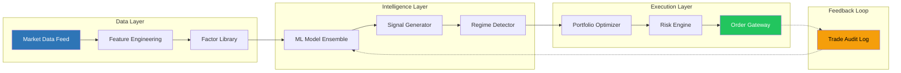
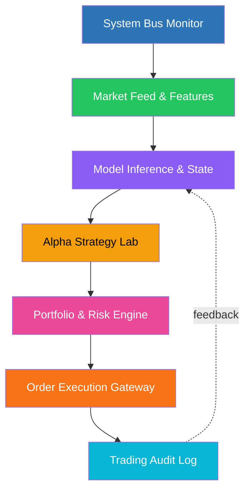
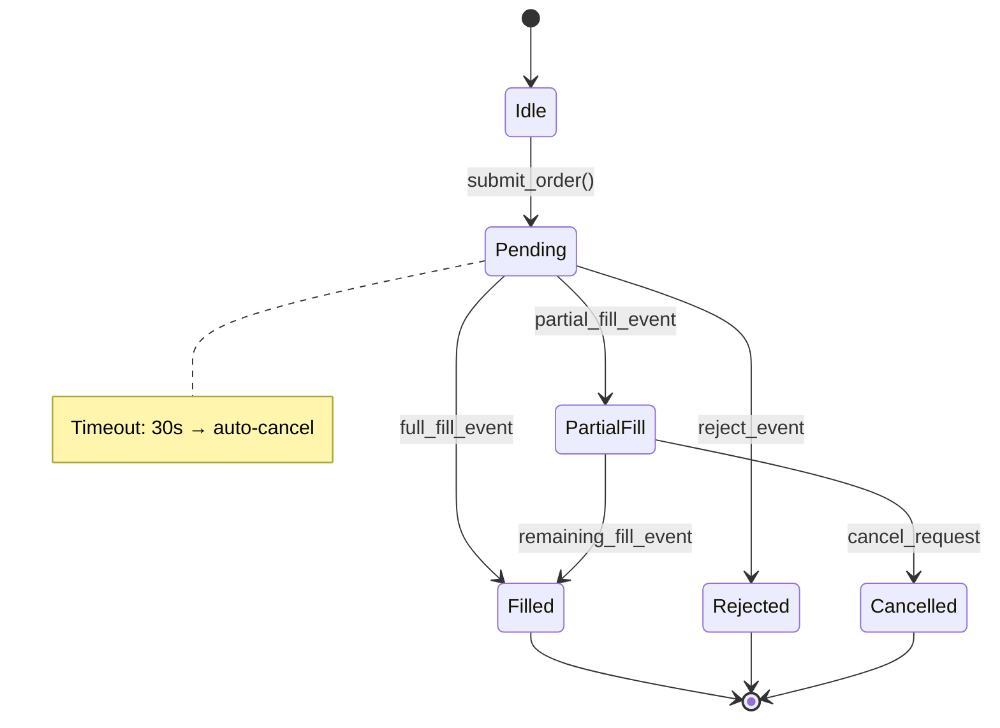
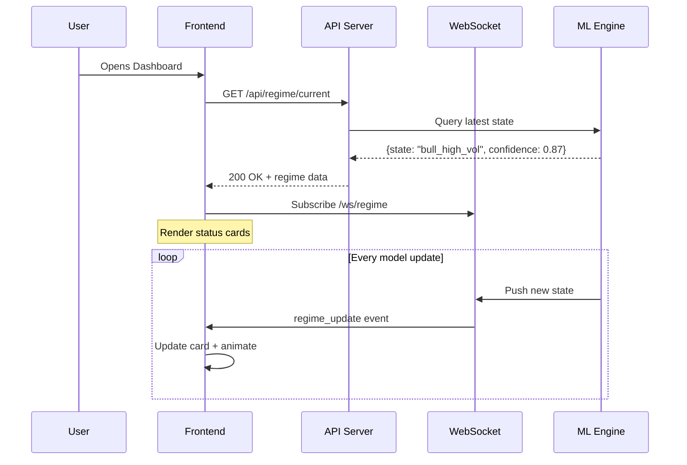

# Phase 4: Visuals — Diagram and Wireframe Generation Protocol

**Purpose:** Generate publication-quality visual artifacts for every module. TWO types are mandatory: Mermaid architecture diagrams AND Pillow wireframe PNGs.

**ENFORCEMENT:** The #1 failure in production testing was "no wireframes generated at all." This phase exists because text-only blueprints are not blueprints — they're essays. Every module MUST have at least one visual. No exceptions.

---

## Visual Type A: Mermaid Architecture & Flow Diagrams

Mermaid is the PRIMARY tool for architecture diagrams because:
- It renders consistently in Markdown, HTML, and PDF
- It's version-controllable (text, not binary)
- Engineers can edit it without design tools
- It can be converted to PNG via `mmdc` (mermaid-cli) for embedding in DOCX

### Minimum Required Mermaid Diagrams

1. **Pipeline Architecture** — End-to-end data flow for Executive Summary
2. **Module Dependency Graph** — Which modules depend on which
3. **State Machine** — For key entities with lifecycle states (e.g., order states, model states)

### Mermaid Setup

```bash
# Install mermaid-cli for PNG rendering
npm install -g @mermaid-js/mermaid-cli

# Render .mmd file to PNG
mmdc -i diagram.mmd -o diagram.png -t dark -w 1800 -H 900
```

If `mmdc` is not available, generate the `.mmd` file anyway and render via Python/Pillow as fallback.

### Mermaid Templates

#### Template 1: Pipeline Architecture (for Executive Summary)



#### Template 2: Module Dependency Graph



#### Template 3: State Machine



#### Template 4: Sequence Diagram (User Interaction)



### Rendering Mermaid to PNG

```bash
# Method 1: mmdc (preferred)
mmdc -i pipeline.mmd -o images/arch_pipeline.png -t dark -w 1800 -H 900 -b '#0F1117'

# Method 2: If mmdc unavailable, use Python fallback
python3 -c "
from PIL import Image, ImageDraw, ImageFont
# ... render boxes and arrows manually (see Pillow section below)
"
```

---

## Visual Type B: UI Wireframes (Python + Pillow)

Use the `wireframe_base.py` toolkit from `scripts/` for consistent wireframe generation.

### Setup

```python
import sys
sys.path.insert(0, 'scripts')
from wireframe_base import WireframeCanvas, Theme, get_font
```

Or copy the classes directly if import path issues arise.

### Canvas Specifications

| Type | Width | Height | Use For |
|------|-------|--------|---------|
| Module wireframe | 1800 | 1000 | Individual module UI mockups |
| Architecture overview | 1800 | 900 | Pipeline and system diagrams |
| Before/After comparison | 1800 | 1200 | Side-by-side current vs proposed |

### Wireframe Requirements

Every module wireframe MUST include:

1. **Left sidebar** (50px) with module navigation icons
2. **Header bar** (44px) with module name and subtitle
3. **Main content area** with realistic, domain-specific sample data
4. **Status indicators** (green/yellow/red dots) where applicable
5. **Interactive state hints** (selected items, hover states, expanded panels)

### CRITICAL: Use Realistic Data

**NEVER use:**
- "Lorem ipsum" or placeholder text
- "Item 1", "Item 2", "Item 3"
- "User A", "User B"
- Round numbers like 100, 200, 300

**ALWAYS use:**
- Domain-specific data that matches the project context
- Realistic values with appropriate precision
- Actual labels, names, and terms from the project domain

### Example: Module Wireframe

```python
from wireframe_base import WireframeCanvas, Theme

sidebar_items = ["SysBus", "Market", "Model", "Alpha", "Risk", "Order", "Audit"]

canvas = WireframeCanvas(
    width=1800, height=1000,
    title="Module 3: Model Inference & State",
    subtitle="Real-time ML ensemble monitoring",
    sidebar_items=sidebar_items,
    active_sidebar=2,
)

# KPI cards row
y = 56
cards = [
    ("Active Regime", "Bull (High Vol)", Theme.GREEN, "87% conf"),
    ("Model Agreement", "3/3 Agree", Theme.GREEN, "Unanimous"),
    ("Last Inference", "2.3s ago", Theme.ACCENT, "p95: 4.1s"),
    ("Signal Queue", "12 pending", Theme.YELLOW, "3 urgent"),
]

card_w = 400
for i, (label, value, color, sub) in enumerate(cards):
    x = 66 + i * (card_w + 16)
    canvas.draw_card((x, y, x + card_w, y + 100), label)
    canvas.draw_kpi(x + 12, y + 40, "", value, color)
    canvas.text(x + 12, y + 75, sub, size=9)

# Model ensemble table
table_y = 180
canvas.draw_card((66, table_y, 1784, table_y + 300), "Model Ensemble Status")
headers = ["Model", "State", "Confidence", "Last Update", "Latency"]
widths = [200, 180, 150, 200, 150]
canvas.draw_table_row(80, table_y + 42, headers, widths, header=True)

rows = [
    ["HMM-4State", "bull_high_vol", "92.1%", "09:30:05 UTC", "1.2s"],
    ["XGBoost-Regime", "bull_high_vol", "84.7%", "09:30:04 UTC", "0.8s"],
    ["LSTM-Seq2Seq", "bull_high_vol", "85.3%", "09:30:06 UTC", "3.1s"],
]
for j, row in enumerate(rows):
    canvas.draw_table_row(80, table_y + 70 + j * 28, row, widths)
    canvas.draw_status_dot(78 + widths[0] + 30, table_y + 74 + j * 28, Theme.GREEN, 6)

# Sparkline chart area
chart_y = 500
canvas.draw_card((66, chart_y, 900, chart_y + 280), "Regime History (30 Days)")
canvas.draw_sparkline(80, chart_y + 50, 800, 200, color=Theme.ACCENT, points=30, seed=42)

# Transition matrix heatmap area
canvas.draw_card((920, chart_y, 1784, chart_y + 280), "Transition Probabilities")
canvas.text(934, chart_y + 42, "From \\ To", size=10, bold=True)
states = ["Bull-HV", "Bull-LV", "Bear-HV", "Bear-LV"]
for i, s in enumerate(states):
    canvas.text(1050 + i * 160, chart_y + 42, s, size=9, color=Theme.ACCENT)
    canvas.text(934, chart_y + 70 + i * 40, s, size=9)

canvas.footer("Alpha Core v2.0 — Model Inference & State — Last refresh: 09:30:06 UTC")
canvas.save("images/03_model_inference.png")
```

---

## Visual Type C: Before/After Comparison (MANDATORY for Optimization Projects)

If optimizing an existing system, create a comparison visual showing:

### Option 1: Side-by-Side (Single Image)

```python
# Create a wider canvas for side-by-side
canvas = WireframeCanvas(width=1800, height=1200, title="Before / After: Dashboard Redesign",
                          show_sidebar=False)

# BEFORE section (left half)
canvas.text(40, 50, "BEFORE", size=18, bold=True, color=Theme.RED)
canvas.draw_card((30, 80, 880, 580), "Current Dashboard")
# ... draw current state elements ...
canvas.text(40, 550, "Problems: 4 separate windows, 12 min/check, no real-time data",
            size=10, color=Theme.RED)

# AFTER section (right half)
canvas.text(920, 50, "AFTER", size=18, bold=True, color=Theme.GREEN)
canvas.draw_card((910, 80, 1770, 580), "Proposed Dashboard")
# ... draw proposed state elements ...
canvas.text(920, 550, "Improvements: Single view, <3s assessment, real-time WebSocket feed",
            size=10, color=Theme.GREEN)

# DELTA section (bottom)
canvas.page_break_line(620)
canvas.text(40, 640, "KEY CHANGES", size=14, bold=True)
# List specific deltas...

canvas.save("images/00_before_after.png")
```

### Option 2: Sequential (Two Images)

Generate `XX_module_before.png` and `XX_module_after.png` pairs, clearly labeled.

### What the Comparison MUST Show

1. **BEFORE**: Current UI / architecture (screenshot description or wireframe of current state)
2. **AFTER**: Proposed UI / architecture (wireframe of proposed state)
3. **DELTA**: Specific callouts of what changed and why (measurable improvements)

---

## File Naming Convention

```
images/
├── 00_pipeline_overview.png          # Executive Summary architecture
├── 00_before_after.png               # Before/after comparison (optimization)
├── 01_system_bus_monitor.png         # Module 1 wireframe
├── 02_market_feed.png                # Module 2 wireframe
├── 03_model_inference.png            # Module 3 wireframe
├── ...
├── arch_pipeline.mmd                 # Mermaid source (keep for version control)
├── arch_pipeline.png                 # Rendered Mermaid diagram
├── arch_dependencies.mmd
├── arch_dependencies.png
└── arch_state_machine.mmd
```

### Naming Rules

- Module wireframes: `XX_module_name.png` (XX = 2-digit module number)
- Architecture diagrams: `arch_*.png`
- Before/after: `XX_module_before.png` / `XX_module_after.png` or `00_before_after.png`
- Mermaid sources: `*.mmd` (keep alongside rendered PNGs)
- Sequential numbering: 00, 01, 02, ... (matches module order)

---

## Color Palette Reference

Use the Theme class from `wireframe_base.py`:

| Name | Hex | Use For |
|------|-----|---------|
| BG | #0F1117 | Main background |
| CARD_BG | #1A1D27 | Card/panel background |
| CARD_BORDER | #2A2D3A | Card borders |
| ACCENT | #2E75B6 | Primary accent (links, headers) |
| GREEN | #22C55E | Success, active, healthy |
| RED | #EF4444 | Error, critical, danger |
| YELLOW | #F59E0B | Warning, caution |
| PURPLE | #8B5CF6 | Secondary accent |
| TEXT | #E5E7EB | Primary text |
| TEXT_DIM | #9CA3AF | Secondary/label text |

---

## GATE 4 — Visual Artifact Check

**STOP HERE. Do not proceed to Phase 5 until every check passes.**

```
□ ≥1 Mermaid architecture diagram generated (.mmd source + .png rendered)
  Minimum: pipeline architecture for Executive Summary
□ ≥1 wireframe PNG per module generated
  (Every module in the blueprint has its own wireframe image)
□ Executive Summary has pipeline overview diagram
  (Not just text — an actual rendered diagram)
□ Before/after comparison exists (MANDATORY for optimization projects)
  Shows current state, proposed state, and measurable deltas
□ Module dependency graph exists
  (Shows which modules depend on which)
□ All wireframes use realistic, domain-specific sample data
  (No "Lorem ipsum", no "Item 1/2/3", no round placeholder numbers)
□ All PNGs saved to images/ directory with sequential naming (00_, 01_, ...)
□ All wireframes include sidebar navigation + header
□ All wireframes are correct dimensions (1800×1000 for modules, 1800×900 for arch)
□ Mermaid .mmd source files kept alongside rendered PNGs

RESULT: □ ALL PASS → proceed to Phase 5
        □ ANY FAIL → fix before proceeding
```

**If any module lacks a visual, generate it before Phase 5.**
